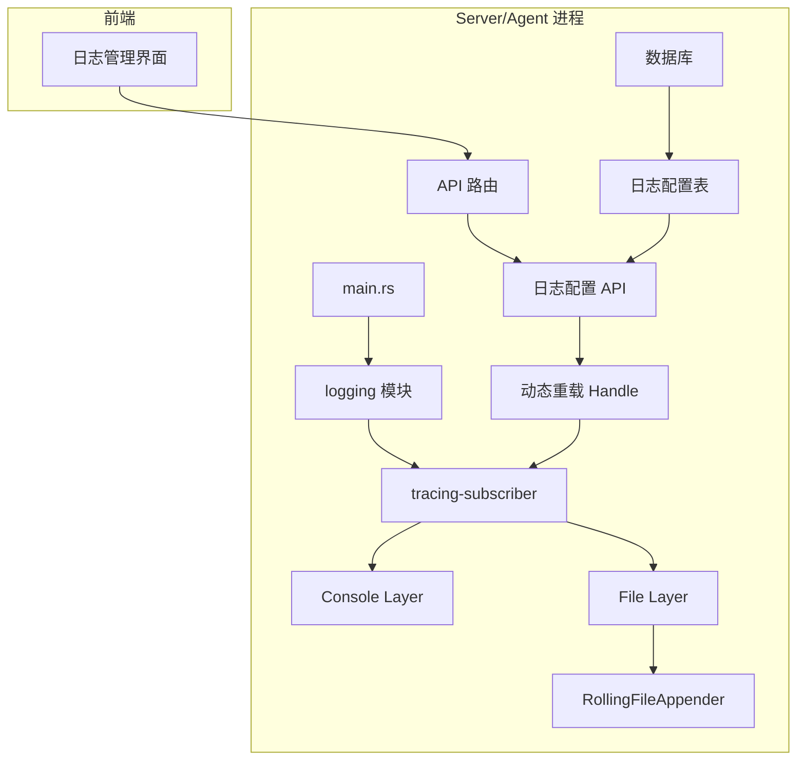
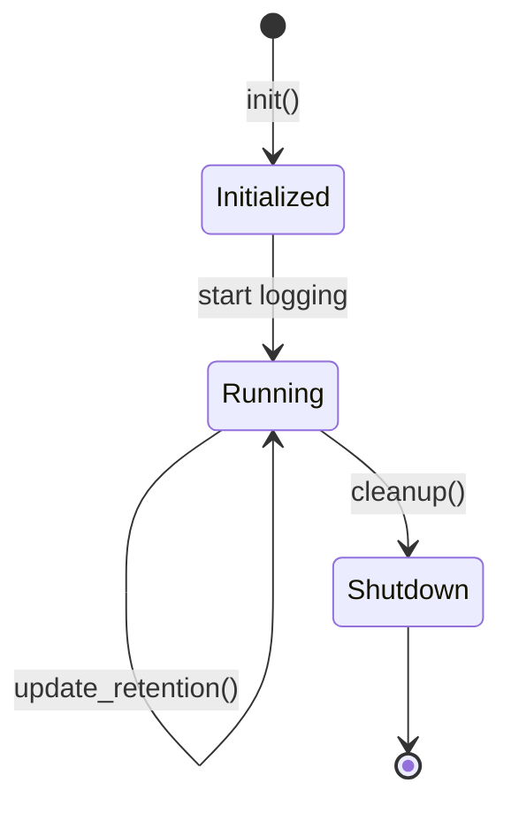
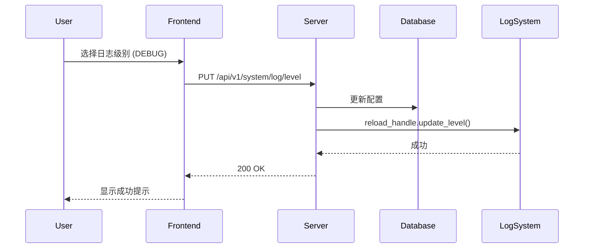
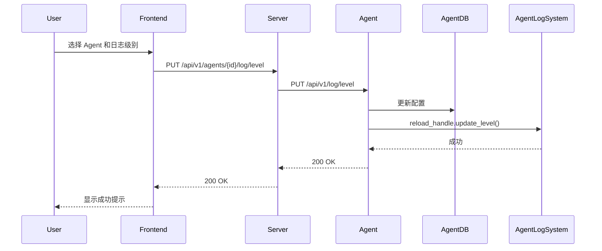

# 设计文档：Tracing 日志系统重构

## 概述

本设计文档描述了如何将 OpsBox 项目从 `log` + `env_logger` 迁移到 `tracing` 生态系统，并实现滚动日志、动态配置等高级功能。设计遵循以下原则：

- **最小侵入性**：尽量保持现有代码结构，只替换日志框架
- **向后兼容**：保持现有的命令行参数和环境变量支持
- **模块化**：日志配置作为独立模块，可被 Server 和 Agent 复用
- **性能优先**：使用异步日志写入，避免阻塞主线程

## 架构

### 整体架构



### 组件说明

1. **logging 模块**：负责初始化 tracing 订阅器，配置日志输出
2. **Console Layer**：控制台输出层，支持彩色输出
3. **File Layer**：文件输出层，使用 RollingFileAppender
4. **RollingFileAppender**：滚动文件追加器，按日期和大小滚动
5. **日志配置 API**：提供 REST API 用于动态调整日志配置
6. **动态重载 Handle**：tracing-subscriber 的 reload 句柄，支持运行时修改
7. **日志配置表**：数据库表，持久化日志配置

## 核心组件和接口

### 1. Logging 模块

#### 1.1 配置结构

```rust
/// 日志配置
#[derive(Debug, Clone, Serialize, Deserialize)]
pub struct LogConfig {
    /// 日志级别
    pub level: LogLevel,
    /// 日志目录
    pub log_dir: PathBuf,
    /// 日志保留数量
    pub retention_count: usize,
    /// 是否启用控制台输出
    pub enable_console: bool,
    /// 是否启用文件输出
    pub enable_file: bool,
}

/// 日志级别枚举
#[derive(Debug, Clone, Copy, Serialize, Deserialize)]
pub enum LogLevel {
    Error,
    Warn,
    Info,
    Debug,
    Trace,
}
```

#### 1.2 初始化接口

```rust
/// 初始化日志系统
/// 
/// 返回一个 ReloadHandle，用于运行时动态修改日志级别
pub fn init(config: LogConfig) -> Result<ReloadHandle, LogError> {
    // 1. 创建 Console Layer（带彩色输出）
    // 2. 创建 File Layer（使用 RollingFileAppender）
    // 3. 组合 Layers 并设置为全局默认
    // 4. 返回 reload handle
}

/// 重载句柄，用于动态修改日志配置
pub struct ReloadHandle {
    inner: tracing_subscriber::reload::Handle<...>,
}

impl ReloadHandle {
    /// 更新日志级别
    pub fn update_level(&self, level: LogLevel) -> Result<(), LogError>;
}
```

#### 1.3 滚动日志实现

使用 `tracing-appender` 的 `RollingFileAppender`：

```rust
use tracing_appender::rolling::{RollingFileAppender, Rotation};

// 按日期滚动，文件名格式：opsbox-server.2024-01-15.log
let file_appender = RollingFileAppender::builder()
    .rotation(Rotation::DAILY)
    .filename_prefix("opsbox-server")
    .filename_suffix("log")
    .max_log_files(config.retention_count)
    .build(config.log_dir)?;
```

**注意**：`tracing-appender` 本身不支持按大小滚动，但支持按时间滚动。对于 10MB 限制，我们将：
- 使用每日滚动作为主要策略
- 通过 `max_log_files` 控制保留数量
- 在文档中说明单个日志文件可能超过 10MB（日志量大的情况）

### 2. 数据库 Schema

#### 2.1 日志配置表

```sql
CREATE TABLE IF NOT EXISTS log_config (
    id INTEGER PRIMARY KEY CHECK (id = 1),  -- 单例配置
    component TEXT NOT NULL,                 -- 'server' 或 'agent'
    level TEXT NOT NULL,                     -- 日志级别
    retention_count INTEGER NOT NULL,        -- 保留文件数量
    updated_at INTEGER NOT NULL              -- 更新时间戳
);

-- 默认配置
INSERT OR IGNORE INTO log_config (id, component, level, retention_count, updated_at)
VALUES (1, 'server', 'info', 7, strftime('%s', 'now'));
```

#### 2.2 Repository 接口

```rust
/// 日志配置仓库
pub struct LogConfigRepository {
    pool: SqlitePool,
}

impl LogConfigRepository {
    /// 获取日志配置
    pub async fn get(&self, component: &str) -> Result<LogConfig, RepositoryError>;
    
    /// 更新日志级别
    pub async fn update_level(&self, component: &str, level: LogLevel) -> Result<(), RepositoryError>;
    
    /// 更新日志保留数量
    pub async fn update_retention(&self, component: &str, count: usize) -> Result<(), RepositoryError>;
}
```

### 3. API 端点设计

#### 3.1 Server 日志配置 API

作为系统级功能，日志配置 API 直接挂载在 Server 根路由下（不属于任何模块）：

```
GET  /api/v1/log/config                 # 获取 Server 日志配置
PUT  /api/v1/log/level                  # 更新 Server 日志级别
PUT  /api/v1/log/retention              # 更新 Server 日志保留数量
```

#### 3.2 Agent 日志配置 API（通过 Server 代理）

Agent 日志配置通过 Agent Manager 模块代理访问：

```
GET  /api/v1/agents/{agent_id}/log/config      # 获取 Agent 日志配置
PUT  /api/v1/agents/{agent_id}/log/level       # 更新 Agent 日志级别
PUT  /api/v1/agents/{agent_id}/log/retention   # 更新 Agent 日志保留数量
```

#### 3.3 Agent 本地 API

Agent 自身提供的日志配置 API（Server 通过这些端点代理）：

```
GET  /api/v1/log/config                 # 获取当前日志配置
PUT  /api/v1/log/level                  # 更新日志级别
PUT  /api/v1/log/retention              # 更新日志保留数量
```

#### 3.4 请求/响应格式

```rust
// 获取配置响应
#[derive(Debug, Serialize, Deserialize)]
pub struct LogConfigResponse {
    /// 日志级别
    pub level: String,
    /// 日志保留数量（天）
    pub retention_count: usize,
    /// 日志目录
    pub log_dir: String,
}

// 更新日志级别请求
#[derive(Debug, Serialize, Deserialize)]
pub struct UpdateLogLevelRequest {
    /// 日志级别: "error" | "warn" | "info" | "debug" | "trace"
    pub level: String,
}

// 更新保留数量请求
#[derive(Debug, Serialize, Deserialize)]
pub struct UpdateRetentionRequest {
    /// 保留数量（天）
    pub retention_count: usize,
}

// 通用成功响应
#[derive(Debug, Serialize)]
pub struct SuccessResponse {
    pub message: String,
}
```

#### 3.5 路由注册

**Server 端**（在 `main.rs` 或新建 `log_routes.rs`）：

```rust
use axum::{Router, routing::{get, put}};

pub fn create_log_routes() -> Router {
    Router::new()
        .route("/api/v1/log/config", get(get_log_config))
        .route("/api/v1/log/level", put(update_log_level))
        .route("/api/v1/log/retention", put(update_log_retention))
}
```

**Agent Manager 模块**（在 `agent-manager/src/routes.rs` 中添加）：

```rust
// 在 create_routes 函数中添加
Router::new()
    // ... 现有路由 ...
    .route("/{agent_id}/log/config", get(proxy_agent_log_config))
    .route("/{agent_id}/log/level", put(proxy_agent_log_level))
    .route("/{agent_id}/log/retention", put(proxy_agent_log_retention))
```

**Agent 端**（在 `agent/src/main.rs` 中添加）：

```rust
// 在 Router::new() 中添加
.route("/api/v1/log/config", get(get_log_config))
.route("/api/v1/log/level", put(update_log_level))
.route("/api/v1/log/retention", put(update_log_retention))
```

### 4. 命令行参数

#### 4.1 Server 参数

```rust
#[derive(Parser)]
pub struct AppConfig {
    // ... 现有参数 ...
    
    /// 日志目录
    #[arg(long = "log-dir", value_name = "DIR", help = "日志文件目录")]
    pub log_dir: Option<PathBuf>,
    
    /// 日志保留数量
    #[arg(long = "log-retention", value_name = "N", help = "保留的日志文件数量", default_value = "7")]
    pub log_retention: usize,
}
```

#### 4.2 Agent 参数

```rust
#[derive(Parser)]
struct Args {
    // ... 现有参数 ...
    
    /// 日志目录
    #[arg(global = true, long = "log-dir", value_name = "DIR", help = "日志文件目录")]
    log_dir: Option<PathBuf>,
    
    /// 日志保留数量
    #[arg(global = true, long = "log-retention", value_name = "N", help = "保留的日志文件数量", default_value = "7")]
    log_retention: usize,
}
```

## 数据模型

### LogConfig 状态机



### 日志文件命名规则

- Server: `opsbox-server.YYYY-MM-DD.log`
- Agent: `opsbox-agent.YYYY-MM-DD.log`
- 当天的日志文件: `opsbox-server.log` (符号链接或直接写入)

## 错误处理

### 错误类型

```rust
#[derive(Debug, thiserror::Error)]
pub enum LogError {
    #[error("日志目录创建失败: {0}")]
    DirectoryCreation(#[from] std::io::Error),
    
    #[error("日志配置无效: {0}")]
    InvalidConfig(String),
    
    #[error("日志级别无效: {0}")]
    InvalidLevel(String),
    
    #[error("数据库错误: {0}")]
    Database(#[from] sqlx::Error),
    
    #[error("重载失败: {0}")]
    ReloadFailed(String),
}
```

### 错误处理策略

1. **初始化失败**：记录错误并退出程序
2. **运行时配置更新失败**：返回错误给调用者，保持当前配置
3. **文件写入失败**：tracing-appender 会自动处理，丢弃日志而不阻塞
4. **数据库错误**：返回 500 错误给前端

## 测试策略

### 单元测试

1. **LogConfig 解析测试**
   - 测试从命令行参数解析配置
   - 测试从环境变量解析配置
   - 测试默认值

2. **日志级别转换测试**
   - 测试字符串到 LogLevel 的转换
   - 测试 LogLevel 到 tracing::Level 的转换

3. **Repository 测试**
   - 测试配置的 CRUD 操作
   - 测试并发更新

### 集成测试

1. **日志输出测试**
   - 验证日志同时输出到控制台和文件
   - 验证日志格式正确

2. **滚动测试**
   - 验证日志按日期滚动
   - 验证旧日志文件被正确清理

3. **动态配置测试**
   - 验证运行时修改日志级别生效
   - 验证配置持久化到数据库

4. **API 测试**
   - 测试所有 API 端点
   - 测试参数验证
   - 测试错误处理

### 性能测试

1. **吞吐量测试**
   - 测试高并发日志写入性能
   - 对比 log 和 tracing 的性能差异

2. **资源使用测试**
   - 测试内存使用
   - 测试 CPU 使用
   - 测试磁盘 I/O

## 迁移策略

### 阶段 1：依赖替换

1. 更新 Cargo.toml，添加 tracing 依赖
2. 移除 log 和 env_logger 依赖
3. 更新所有 `use log::*` 为 `use tracing::*`

### 阶段 2：核心实现

1. 实现新的 logging 模块
2. 实现数据库 schema 和 repository
3. 更新 Server 和 Agent 的 main.rs

### 阶段 3：API 实现

1. 实现 Server 日志配置 API
2. 实现 Agent 日志配置 API
3. 添加 API 测试

### 阶段 4：前端集成

1. 实现前端日志管理界面
2. 集成 API 调用
3. 添加 E2E 测试

### 阶段 5：文档和清理

1. 更新用户文档
2. 更新开发者文档
3. 清理旧代码

## 依赖项

### 新增依赖

```toml
# Workspace dependencies
[workspace.dependencies]
tracing = "0.1"
tracing-subscriber = { version = "0.3", features = ["env-filter", "json", "fmt"] }
tracing-appender = "0.2"

# Server/Agent dependencies
[dependencies]
tracing = { workspace = true }
tracing-subscriber = { workspace = true }
tracing-appender = { workspace = true }
```

### 移除依赖

```toml
# 移除这些依赖
log = "0.4"
env_logger = "0.11"
```

## 配置示例

### Server 启动示例

```bash
# 使用默认配置
./opsbox-server

# 自定义日志目录和保留数量
./opsbox-server --log-dir /var/log/opsbox --log-retention 30

# 设置日志级别
./opsbox-server --log-level debug

# 使用环境变量
RUST_LOG=debug ./opsbox-server
```

### Agent 启动示例

```bash
# 使用默认配置
./opsbox-agent

# 自定义日志配置
./opsbox-agent --log-dir /var/log/opsbox-agent --log-retention 14 --log-level info
```

## 性能考虑

### 异步写入

使用 `tracing-appender` 的 `non_blocking` 功能：

```rust
let (non_blocking, _guard) = tracing_appender::non_blocking(file_appender);
```

这会创建一个后台线程处理日志写入，避免阻塞主线程。

### 缓冲策略

- 使用默认的缓冲区大小（8KB）
- 在关闭时自动刷新缓冲区（通过 `_guard` 的 Drop 实现）

### 过滤优化

使用 `EnvFilter` 进行高效的日志过滤：

```rust
let filter = EnvFilter::try_from_default_env()
    .or_else(|_| EnvFilter::try_new("info"))
    .unwrap();
```

## 安全考虑

1. **路径验证**：验证日志目录路径，防止路径遍历攻击
2. **权限检查**：确保日志目录有正确的写入权限
3. **磁盘空间**：监控磁盘空间，避免日志填满磁盘
4. **敏感信息**：避免在日志中记录密码、密钥等敏感信息

## 向后兼容性

1. **环境变量**：继续支持 `RUST_LOG` 环境变量
2. **命令行参数**：保持现有的 `--log-level` 和 `-v` 参数
3. **日志格式**：保持与现有日志格式相似，便于现有工具解析

## 前端设计

### 页面结构调整

#### 1. 系统设置页面

在现有的系统设置页面中添加"Server 日志设置"：

```
系统设置
├── 基本设置
├── Server 日志设置 (新增)
└── 其他设置
```

#### 2. Agent 管理页面

在现有的 Agent 详情/编辑页面中添加"日志设置"标签页：

```
Agent 管理
├── Agent 列表
└── Agent 详情
    ├── 基本信息
    ├── 搜索配置
    ├── 日志设置 (新增)
    └── 状态监控
```

### 界面设计

#### 1. 系统设置 - Server 日志设置

```
┌─────────────────────────────────────────────────────────┐
│ 系统设置 > Server 日志设置                              │
├─────────────────────────────────────────────────────────┤
│                                                          │
│  日志级别:  [下拉选择: INFO ▼]                          │
│             ERROR | WARN | INFO | DEBUG | TRACE          │
│                                                          │
│  日志保留:  [输入框: 7] 天                              │
│             (保留最近 N 天的日志文件)                    │
│                                                          │
│  日志路径:  /home/user/.opsbox/logs                     │
│             (只读，启动时指定)                           │
│                                                          │
│  [保存]  [取消]                                         │
│                                                          │
│ 💡 提示：                                               │
│ • 修改日志级别会立即生效，无需重启服务                  │
│ • 修改日志保留数量会在下次日志滚动时生效                │
│ • DEBUG 和 TRACE 级别会产生大量日志，建议仅在排查问题时使用 │
│                                                          │
└─────────────────────────────────────────────────────────┘
```

#### 2. Agent 详情 - 日志设置标签页

```
┌─────────────────────────────────────────────────────────┐
│ Agent: agent-host1                                       │
├─────────────────────────────────────────────────────────┤
│ [基本信息] [搜索配置] [日志设置] [状态监控]            │
├─────────────────────────────────────────────────────────┤
│                                                          │
│  日志级别:  [下拉选择: INFO ▼]                          │
│             ERROR | WARN | INFO | DEBUG | TRACE          │
│                                                          │
│  日志保留:  [输入框: 7] 天                              │
│             (保留最近 N 天的日志文件)                    │
│                                                          │
│  日志路径:  /home/user/.opsbox-agent/logs               │
│             (只读，启动时指定)                           │
│                                                          │
│  Agent 状态: ● 在线                                     │
│                                                          │
│  [保存]  [取消]                                         │
│                                                          │
│ 💡 提示：                                               │
│ • 修改日志级别会立即生效，无需重启 Agent                │
│ • 修改日志保留数量会在下次日志滚动时生效                │
│ • 仅在 Agent 在线时可以修改配置                         │
│                                                          │
└─────────────────────────────────────────────────────────┘
```

### 前端组件设计

#### 技术栈

- **框架**: Svelte 5 (使用 runes API)
- **样式**: TailwindCSS + CSS 变量
- **路由**: SvelteKit
- **HTTP 客户端**: fetch API

#### 1. ServerLogSettings 组件

在系统设置页面添加新的标签页：

**文件位置**: `web/src/routes/settings/ServerLogSettings.svelte`

```svelte
<script lang="ts">
  /**
   * Server 日志设置组件
   * 管理 Server 的日志级别和保留策略
   */
  import Alert from '$lib/components/Alert.svelte';
  import SettingsInput from './SettingsInput.svelte';

  interface LogConfig {
    level: 'error' | 'warn' | 'info' | 'debug' | 'trace';
    retention_count: number;
    log_dir: string;
  }

  let config = $state<LogConfig | null>(null);
  let loading = $state(false);
  let error = $state<string | null>(null);
  let success = $state<string | null>(null);

  // 初始化加载
  let inited = $state(false);
  $effect(() => {
    if (inited) return;
    inited = true;
    loadConfig();
  });

  async function loadConfig() {
    loading = true;
    error = null;
    try {
      const res = await fetch('/api/v1/system/log/config');
      if (!res.ok) throw new Error('加载配置失败');
      config = await res.json();
    } catch (e) {
      error = e instanceof Error ? e.message : '加载配置失败';
    } finally {
      loading = false;
    }
  }

  async function handleSave() {
    if (!config) return;
    loading = true;
    error = null;
    success = null;
    
    try {
      // 更新日志级别
      const levelRes = await fetch('/api/v1/system/log/level', {
        method: 'PUT',
        headers: { 'Content-Type': 'application/json' },
        body: JSON.stringify({ level: config.level })
      });
      if (!levelRes.ok) throw new Error('更新日志级别失败');

      // 更新保留数量
      const retentionRes = await fetch('/api/v1/system/log/retention', {
        method: 'PUT',
        headers: { 'Content-Type': 'application/json' },
        body: JSON.stringify({ retention_count: config.retention_count })
      });
      if (!retentionRes.ok) throw new Error('更新保留数量失败');

      success = '配置已保存';
      setTimeout(() => { success = null; }, 3000);
    } catch (e) {
      error = e instanceof Error ? e.message : '保存失败';
    } finally {
      loading = false;
    }
  }
</script>

<div class="space-y-6">
  {#if error}
    <Alert type="error" message={error} onClose={() => (error = null)} />
  {/if}

  {#if success}
    <Alert type="success" message={success} onClose={() => (success = null)} />
  {/if}

  <section class="rounded-3xl border border-[var(--border)] bg-[var(--surface)] p-6 shadow-lg shadow-black/5">
    <div class="mb-6">
      <h2 class="text-lg font-semibold text-[var(--text)]">Server 日志设置</h2>
      <p class="mt-1 text-sm text-[var(--muted)]">配置 Server 的日志级别和保留策略</p>
    </div>

    {#if loading && !config}
      <div class="py-10 text-center text-sm text-[var(--muted)]">加载中…</div>
    {:else if config}
      <div class="space-y-4">
        <!-- 日志级别 -->
        <label class="flex flex-col gap-3 rounded-2xl border border-transparent bg-white/60 p-4 text-sm text-slate-500 shadow-sm shadow-slate-200/40 transition hover:border-slate-200 hover:shadow-slate-200 dark:bg-slate-900/60 dark:text-slate-400 dark:hover:border-slate-700">
          <span>
            <span class="block text-xs font-semibold tracking-[0.2em] text-indigo-500 uppercase dark:text-indigo-400">
              日志级别
            </span>
            <span class="block text-sm leading-relaxed text-slate-600 dark:text-slate-300">
              控制日志输出的详细程度
            </span>
          </span>
          <select
            class="w-full rounded-xl border border-slate-200 bg-white px-3 py-3 text-sm text-slate-900 shadow-inner shadow-slate-200 focus:border-indigo-500 focus:ring-4 focus:ring-indigo-100 focus:outline-none dark:border-slate-700 dark:bg-slate-950 dark:text-slate-100 dark:shadow-none dark:focus:border-indigo-400 dark:focus:ring-indigo-500/30"
            bind:value={config.level}
          >
            <option value="error">ERROR - 仅错误</option>
            <option value="warn">WARN - 警告及以上</option>
            <option value="info">INFO - 信息及以上（推荐）</option>
            <option value="debug">DEBUG - 调试及以上</option>
            <option value="trace">TRACE - 全部日志</option>
          </select>
        </label>

        <!-- 日志保留 -->
        <label class="flex flex-col gap-3 rounded-2xl border border-transparent bg-white/60 p-4 text-sm text-slate-500 shadow-sm shadow-slate-200/40 transition hover:border-slate-200 hover:shadow-slate-200 dark:bg-slate-900/60 dark:text-slate-400 dark:hover:border-slate-700">
          <span>
            <span class="block text-xs font-semibold tracking-[0.2em] text-indigo-500 uppercase dark:text-indigo-400">
              日志保留
            </span>
            <span class="block text-sm leading-relaxed text-slate-600 dark:text-slate-300">
              保留最近 N 天的日志文件
            </span>
          </span>
          <div class="flex items-center gap-2">
            <input
              type="number"
              class="w-full rounded-xl border border-slate-200 bg-white px-3 py-3 text-sm text-slate-900 shadow-inner shadow-slate-200 focus:border-indigo-500 focus:ring-4 focus:ring-indigo-100 focus:outline-none dark:border-slate-700 dark:bg-slate-950 dark:text-slate-100 dark:shadow-none dark:focus:border-indigo-400 dark:focus:ring-indigo-500/30"
              bind:value={config.retention_count}
              min="1"
              max="365"
            />
            <span class="text-sm text-[var(--text)]">天</span>
          </div>
        </label>

        <!-- 日志路径（只读） -->
        <label class="flex flex-col gap-3 rounded-2xl border border-transparent bg-white/60 p-4 text-sm text-slate-500 shadow-sm shadow-slate-200/40 transition dark:bg-slate-900/60 dark:text-slate-400">
          <span>
            <span class="block text-xs font-semibold tracking-[0.2em] text-indigo-500 uppercase dark:text-indigo-400">
              日志路径
            </span>
            <span class="block text-sm leading-relaxed text-slate-600 dark:text-slate-300">
              日志文件存储位置（启动时指定）
            </span>
          </span>
          <input
            type="text"
            class="w-full rounded-xl border border-slate-200 bg-slate-100 px-3 py-3 text-sm text-slate-900 shadow-inner shadow-slate-200 dark:border-slate-700 dark:bg-slate-900 dark:text-slate-400"
            value={config.log_dir}
            disabled
          />
        </label>

        <!-- 操作按钮 -->
        <div class="flex items-center gap-3 pt-2">
          <button
            class="rounded-xl bg-[var(--primary)] px-6 py-2.5 text-sm font-semibold text-[var(--primary-foreground)] shadow-sm transition hover:opacity-90 focus:ring-4 focus:ring-[var(--ring)] focus:outline-none disabled:opacity-50"
            onclick={handleSave}
            disabled={loading}
          >
            {loading ? '保存中…' : '保存'}
          </button>
          <button
            class="rounded-xl bg-[var(--surface-2)] px-6 py-2.5 text-sm font-medium text-[var(--text)] transition hover:bg-[var(--surface)]"
            onclick={loadConfig}
            disabled={loading}
          >
            重置
          </button>
        </div>
      </div>
    {/if}
  </section>

  <!-- 提示信息 -->
  <Alert
    type="info"
    message="提示"
  >
    <ul class="list-disc space-y-1 pl-5 text-sm">
      <li>修改日志级别会立即生效，无需重启服务</li>
      <li>修改日志保留数量会在下次日志滚动时生效</li>
      <li>DEBUG 和 TRACE 级别会产生大量日志，建议仅在排查问题时使用</li>
    </ul>
  </Alert>
</div>
```

#### 2. 更新 AgentManagement 组件

在现有的 `AgentManagement.svelte` 中添加日志设置功能。

**修改方案**：为每个 Agent 卡片添加"日志设置"展开区域，或者添加一个"配置"按钮打开模态框。

**推荐方案**：在 Agent 卡片中添加可展开的日志设置区域

```svelte
<!-- 在 AgentManagement.svelte 的 Agent 卡片中添加 -->
<div class="rounded-xl border border-[var(--border)] bg-[var(--surface-2)] p-4">
  <!-- 现有的 Agent 信息 -->
  <div class="flex flex-col gap-3 md:flex-row md:items-center md:justify-between">
    <!-- ... 现有代码 ... -->
  </div>

  <!-- 标签管理 -->
  <!-- ... 现有代码 ... -->

  <!-- 新增：日志设置（可展开） -->
  <div class="mt-4 border-t border-[var(--border)] pt-4">
    <button
      class="flex w-full items-center justify-between text-sm font-medium text-[var(--text)] hover:text-[var(--primary)]"
      onclick={() => (expandedLogSettings[a.id] = !expandedLogSettings[a.id])}
    >
      <span>日志设置</span>
      <svg
        class="h-4 w-4 transition-transform {expandedLogSettings[a.id] ? 'rotate-180' : ''}"
        viewBox="0 0 24 24"
        stroke="currentColor"
        fill="none"
      >
        <path stroke-linecap="round" stroke-linejoin="round" stroke-width="2" d="M19 9l-7 7-7-7" />
      </svg>
    </button>

    {#if expandedLogSettings[a.id]}
      <div class="mt-4 space-y-3">
        <!-- 日志级别 -->
        <div class="flex items-center gap-3">
          <label class="w-24 text-sm text-[var(--muted)]">日志级别</label>
          <select
            class="flex-1 rounded-lg border border-[var(--border)] bg-[var(--surface)] px-3 py-2 text-sm text-[var(--text)] focus:border-[var(--primary)] focus:ring-2 focus:ring-[var(--ring)] focus:outline-none"
            bind:value={agentLogConfigs[a.id]?.level}
            disabled={a.status?.type !== 'Online'}
          >
            <option value="error">ERROR</option>
            <option value="warn">WARN</option>
            <option value="info">INFO</option>
            <option value="debug">DEBUG</option>
            <option value="trace">TRACE</option>
          </select>
        </div>

        <!-- 日志保留 -->
        <div class="flex items-center gap-3">
          <label class="w-24 text-sm text-[var(--muted)]">日志保留</label>
          <input
            type="number"
            class="flex-1 rounded-lg border border-[var(--border)] bg-[var(--surface)] px-3 py-2 text-sm text-[var(--text)] focus:border-[var(--primary)] focus:ring-2 focus:ring-[var(--ring)] focus:outline-none"
            bind:value={agentLogConfigs[a.id]?.retention_count}
            min="1"
            max="365"
            disabled={a.status?.type !== 'Online'}
          />
          <span class="text-sm text-[var(--muted)]">天</span>
        </div>

        <!-- 操作按钮 -->
        <div class="flex items-center gap-2">
          <button
            class="rounded-lg bg-[var(--primary)] px-4 py-1.5 text-xs font-semibold text-[var(--primary-foreground)] shadow-sm transition hover:opacity-90 focus:ring-4 focus:ring-[var(--ring)] focus:outline-none disabled:opacity-50"
            onclick={() => handleSaveAgentLogConfig(a.id)}
            disabled={a.status?.type !== 'Online' || agentsStore.loading}
          >
            保存
          </button>
          {#if a.status?.type !== 'Online'}
            <span class="text-xs text-amber-600 dark:text-amber-400">Agent 离线，无法修改配置</span>
          {/if}
        </div>
      </div>
    {/if}
  </div>
</div>
```

#### 3. 更新设置页面主文件

在 `web/src/routes/settings/+page.svelte` 中添加新的标签页：

```svelte
<script lang="ts">
  import ServerLogSettings from './ServerLogSettings.svelte';
  // ... 其他导入 ...

  // 添加新的标签
  let activeTab = $state<'profiles' | 'agents' | 'planners' | 'llm' | 'server-log'>('profiles');
</script>

<!-- 在导航栏中添加新标签 -->
<nav class="flex items-center gap-6 border-b border-[var(--border)] pb-3 text-sm font-medium text-[var(--muted)]">
  <!-- ... 现有标签 ... -->
  <button
    type="button"
    class="rounded-full px-3 py-1 transition {activeTab === 'server-log'
      ? 'bg-[var(--surface)] text-[var(--text)] shadow-sm'
      : 'text-[var(--muted)] hover:text-[var(--text)]'}"
    onclick={() => (activeTab = 'server-log')}
  >
    Server 日志
  </button>
</nav>

<!-- 在内容区域添加新组件 -->
{#if activeTab === 'server-log'}
  <ServerLogSettings />
{:else if activeTab === 'profiles'}
  <ProfileManagement />
<!-- ... 其他标签 ... -->
{/if}
```
```

#### 3. AgentLogConfig 组件

Agent 日志配置组件（支持多 Agent 选择）：

```typescript
interface AgentLogConfigProps {}

interface Agent {
  id: string;
  name: string;
}

const AgentLogConfig: React.FC<AgentLogConfigProps> = () => {
  const [agents, setAgents] = useState<Agent[]>([]);
  const [selectedAgent, setSelectedAgent] = useState<string | null>(null);
  const [config, setConfig] = useState<LogConfig | null>(null);

  // 加载 Agent 列表
  useEffect(() => {
    fetchAgents();
  }, []);

  // 加载选中 Agent 的配置
  useEffect(() => {
    if (selectedAgent) {
      fetchAgentLogConfig(selectedAgent);
    }
  }, [selectedAgent]);

  const fetchAgents = async () => {
    // GET /api/v1/agents
  };

  const fetchAgentLogConfig = async (agentId: string) => {
    // 通过 Server 代理到 Agent: GET /api/v1/agents/{agentId}/log/config
  };

  const handleUpdateLevel = async (level: string) => {
    // PUT /api/v1/agents/{agentId}/log/level
  };

  const handleUpdateRetention = async (count: number) => {
    // PUT /api/v1/agents/{agentId}/log/retention
  };

  return (
    <Card title="Agent 日志配置">
      <Form>
        <FormItem label="选择 Agent">
          <Select 
            value={selectedAgent} 
            onChange={setSelectedAgent}
            placeholder="请选择 Agent"
          >
            {agents.map(agent => (
              <Option key={agent.id} value={agent.id}>
                {agent.name}
              </Option>
            ))}
          </Select>
        </FormItem>
        
        {selectedAgent && (
          <>
            <FormItem label="日志级别">
              <Select value={config?.level} onChange={handleUpdateLevel}>
                <Option value="error">ERROR</Option>
                <Option value="warn">WARN</Option>
                <Option value="info">INFO</Option>
                <Option value="debug">DEBUG</Option>
                <Option value="trace">TRACE</Option>
              </Select>
            </FormItem>
            
            <FormItem label="日志保留">
              <InputNumber 
                value={config?.retention_count} 
                onChange={handleUpdateRetention}
                min={1}
                max={365}
                suffix="天"
              />
            </FormItem>
            
            <FormItem label="日志路径">
              <Input value={config?.log_dir} disabled />
            </FormItem>
            
            <FormItem>
              <Button type="primary" onClick={handleApply}>应用更改</Button>
              <Button onClick={handleReset}>重置</Button>
            </FormItem>
          </>
        )}
      </Form>
    </Card>
  );
};
```

### API 代理设计

由于 Agent 可能在不同的网络环境中，前端无法直接访问 Agent API，需要通过 Server 的 Agent Manager 模块代理。

#### 代理实现

在 `agent-manager/src/routes.rs` 中添加代理路由：

```rust
/// 代理获取 Agent 日志配置
async fn proxy_agent_log_config(
    Path(agent_id): Path<String>,
    State(manager): State<Arc<AgentManager>>,
) -> Result<Json<LogConfigResponse>, (StatusCode, String)> {
    // 1. 获取 Agent 信息（包含 host 和 listen_port 标签）
    let agent = manager
        .get_agent(&agent_id)
        .await
        .ok_or_else(|| (StatusCode::NOT_FOUND, format!("Agent {} 不存在", agent_id)))?;
    
    // 2. 从标签中提取 host 和 port
    let host = agent.tags.iter()
        .find(|t| t.key == "host")
        .map(|t| t.value.clone())
        .ok_or_else(|| (StatusCode::INTERNAL_SERVER_ERROR, "Agent 缺少 host 标签".to_string()))?;
    
    let port = agent.tags.iter()
        .find(|t| t.key == "listen_port")
        .and_then(|t| t.value.parse::<u16>().ok())
        .unwrap_or(4001);
    
    // 3. 构造 Agent API URL
    let endpoint = format!("http://{}:{}", host, port);
    let url = format!("{}/api/v1/log/config", endpoint);
    
    // 4. 转发请求
    let client = reqwest::Client::new();
    let response = client.get(&url)
        .timeout(std::time::Duration::from_secs(10))
        .send()
        .await
        .map_err(|e| (StatusCode::BAD_GATEWAY, format!("无法连接到 Agent: {}", e)))?;
    
    if !response.status().is_success() {
        return Err((StatusCode::BAD_GATEWAY, "Agent 返回错误".to_string()));
    }
    
    let config = response.json::<LogConfigResponse>()
        .await
        .map_err(|e| (StatusCode::INTERNAL_SERVER_ERROR, format!("解析响应失败: {}", e)))?;
    
    Ok(Json(config))
}

/// 代理更新 Agent 日志级别
async fn proxy_agent_log_level(
    Path(agent_id): Path<String>,
    State(manager): State<Arc<AgentManager>>,
    Json(req): Json<UpdateLogLevelRequest>,
) -> Result<Json<SuccessResponse>, (StatusCode, String)> {
    // 类似的代理逻辑
    // ...
}

/// 代理更新 Agent 日志保留数量
async fn proxy_agent_log_retention(
    Path(agent_id): Path<String>,
    State(manager): State<Arc<AgentManager>>,
    Json(req): Json<UpdateRetentionRequest>,
) -> Result<Json<SuccessResponse>, (StatusCode, String)> {
    // 类似的代理逻辑
    // ...
}
```

#### 错误处理

代理请求可能遇到的错误：

1. **Agent 不存在**: 返回 404 Not Found
2. **Agent 离线**: 返回 502 Bad Gateway，消息 "无法连接到 Agent"
3. **Agent 返回错误**: 返回 502 Bad Gateway，消息 "Agent 返回错误"
4. **超时**: 返回 504 Gateway Timeout
5. **解析失败**: 返回 500 Internal Server Error

### 交互流程

#### 更新 Server 日志级别



#### 更新 Agent 日志级别



### 错误处理

#### 前端错误提示

1. **网络错误**：显示 "无法连接到服务器，请检查网络连接"
2. **Agent 离线**：显示 "Agent 离线，无法更新配置"
3. **参数验证失败**：显示具体的验证错误信息
4. **权限不足**：显示 "没有权限修改日志配置"

#### 错误状态显示

```typescript
{error && (
  <Alert 
    type="error" 
    message="配置更新失败" 
    description={error}
    closable
    onClose={() => setError(null)}
  />
)}
```

### 样式设计

使用现有的 TailwindCSS + CSS 变量设计系统，保持与其他设置页面一致的风格：

**CSS 变量**（已在项目中定义）：
- `--text`: 主文本颜色
- `--muted`: 次要文本颜色
- `--surface`: 表面背景色
- `--surface-2`: 次级表面背景色
- `--border`: 边框颜色
- `--primary`: 主色调
- `--primary-foreground`: 主色调前景色
- `--ring`: 焦点环颜色

**组件样式规范**：
1. **卡片容器**: `rounded-3xl border border-[var(--border)] bg-[var(--surface)] p-6 shadow-lg shadow-black/5`
2. **输入框**: `rounded-xl border border-slate-200 bg-white px-3 py-3 text-sm focus:border-indigo-500 focus:ring-4 focus:ring-indigo-100`
3. **按钮**: `rounded-xl bg-[var(--primary)] px-6 py-2.5 text-sm font-semibold text-[var(--primary-foreground)] shadow-sm transition hover:opacity-90`
4. **标签**: `text-xs font-semibold tracking-[0.2em] text-indigo-500 uppercase`

### 响应式设计

使用 TailwindCSS 的响应式工具类：

- **移动端** (`< 768px`): 单列布局，全宽表单
- **平板端** (`768px - 1024px`): 单列布局，限制最大宽度
- **桌面端** (`> 1024px`): 单列布局，最大宽度 `max-w-5xl`

```svelte
<!-- 响应式容器 -->
<div class="mx-auto flex max-w-5xl flex-col gap-6 px-6 pb-16">
  <!-- 内容 -->
</div>

<!-- 响应式表单 -->
<div class="flex flex-col gap-4 md:flex-row md:items-end md:justify-between">
  <!-- 表单项 -->
</div>
```

## 未来扩展

1. **结构化日志**：支持 JSON 格式输出
2. **远程日志**：支持发送日志到远程日志服务（如 Elasticsearch）
3. **日志查询**：提供 API 查询历史日志
4. **日志分析**：集成日志分析和告警功能
5. **Span 追踪**：利用 tracing 的 span 功能进行分布式追踪
6. **日志下载**：支持从前端下载日志文件
7. **实时日志查看**：支持在前端实时查看日志流
