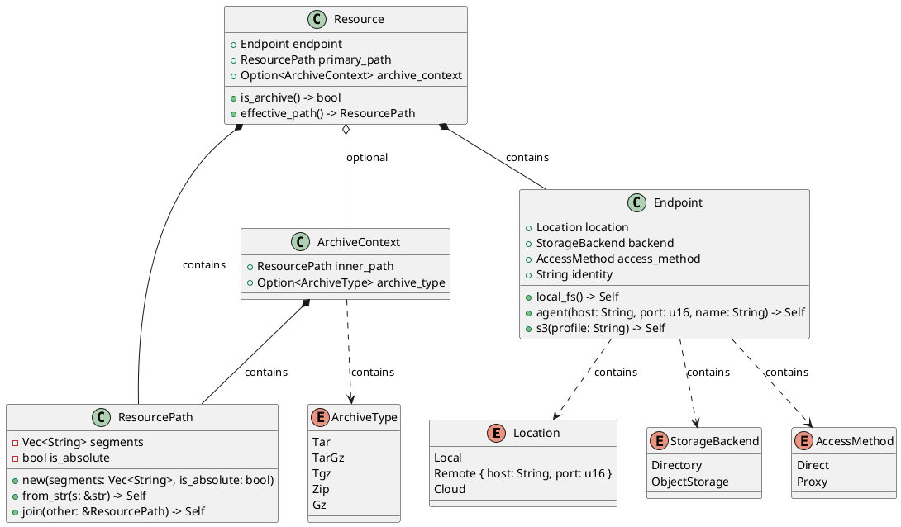
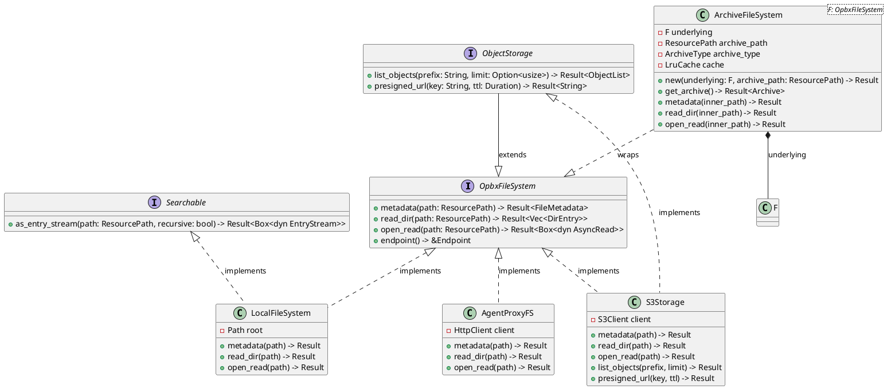
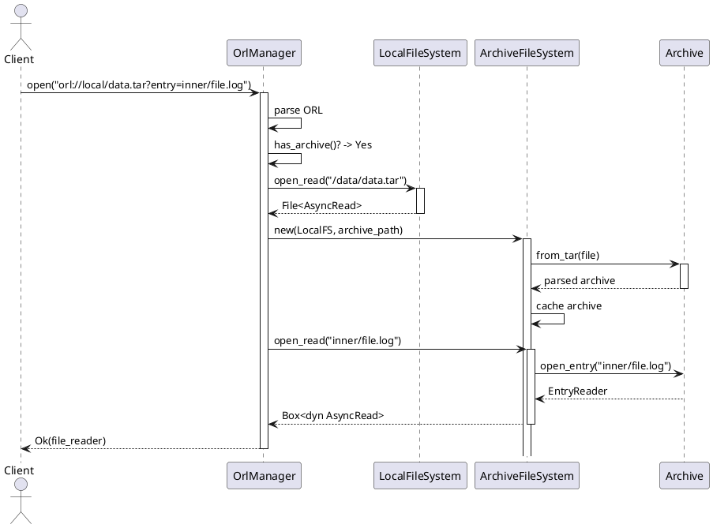
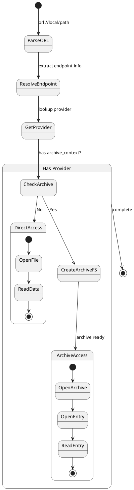

# OpsBox 分布式文件系统 (DFS) 完整设计文档

**版本**: 2.0
**日期**: 2026-02-04
**状态**: 设计草案

---

## 目录

1. [文档概述](#1-文档概述)
2. [背景与问题分析](#2-背景与问题分析)
3. [核心领域概念](#3-核心领域概念)
4. [概念关系模型](#4-概念关系模型)
5. [UML 设计图](#5-uml-设计图)
6. [架构设计](#6-架构设计)
7. [实现指南](#7-实现指南)
8. [迁移路线图](#8-迁移路线图)

---

## 1. 文档概述

### 1.1 文档目的

本文档是 OpsBox 分布式文件系统 (DFS) 的完整设计规范，整合了设计评审、概念重构和 Archive 建模三个方面的内容，为 DDD 重构提供统一的指导。

### 1.2 文档结构

```
dfs-complete-design.md (本文档)
├── 问题诊断：当前设计的问题清单
├── 概念定义：核心领域概念的精确定义
├── 关系模型：概念之间的正交关系
├── UML 图：类图、序列图、状态图
├── 架构设计：分层架构和模块划分
└── 实施指南：具体的实现步骤
```

### 1.3 相关文档

| 文档 | 用途 |
|------|------|
| `dfs-design-review.md` | 原始问题清单 |
| `dfs-model-redesign.md` | Endpoint 概念重构方案 |
| `dfs-archive-concept.md` | Archive 概念深入分析 |

---

## 2. 背景与问题分析

### 2.1 当前设计概述

OpsBox DFS 通过 ORL (OpsBox Resource Locator) 协议实现了统一的资源定位，支持三种存储后端：

```rust
pub enum EndpointType {
  Local,   // 本地文件系统
  Agent,   // 远程代理
  S3,      // 云端对象存储
}
```

**设计亮点**：
- ✅ 统一的 ORL 协议抽象
- ✅ 支持多种存储后端
- ✅ 通过 `OpsFileSystem` trait 实现多态
- ✅ 整体架构清晰，符合 DDD 基本思想

### 2.2 核心问题清单

#### 问题 1：概念层次混淆

**严重程度**: 🔴 高

**问题描述**：Local、Agent、S3 不在同一抽象层次

```rust
// ❌ 错误：将不同层次的概念混在一起
pub enum EndpointType {
  Local,   // 位置：本机
  Agent,   // 访问方式：代理  ← 但实际上是远程的 Local
  S3,      // 存储：对象存储
}
```

**本质问题**：
- **Agent** 在其运行的服务器上就是 **Local**
- Agent = 远程的 Local，是 **位置** 与 **访问方式** 的组合
- 这混淆了 **资源在哪里** 和 **如何访问资源** 两个正交概念

**影响范围**：
- 领域模型语义不清
- 难以表达复杂的访问场景
- 扩展性差（如添加 EFS、MinIO）

---

#### 问题 2：Archive 概念错位

**严重程度**: 🟡 中

**问题描述**：Archive 被当作 `TargetType`，但实际是容器属性

```rust
// ❌ 错误：Archive 与 Endpoint 同级
pub enum TargetType {
  Dir,      // 普通目录
  Archive,  // 归档文件
}
```

**本质问题**：
- Archive 不是存储后端，而是 **容器格式**
- Archive 可以存在于任何存储上 (Local/S3/Agent)
- Archive 本身是一个 **虚拟文件系统**

**正确关系**：
```
Archive 与 Endpoint 是正交关系：
- Local 存储上可以有 .tar 文件
- S3 存储上可以有 .zip 文件
- Agent 访问的远程存储上可以有 .tar.gz 文件
```

---

#### 问题 3：ORL 职责过重

**严重程度**: 🟡 中

**问题描述**：ORL 承担了过多职责

```rust
// ❌ ORL 做了太多事情
impl ORL {
  // URI 解析职责
  pub fn endpoint_type(&self) -> Result<EndpointType, OrlError>
  pub fn endpoint_id(&self) -> Option<&str>

  // 路径操作职责
  pub fn join(&self, subpath: &str) -> Result<Self, OrlError>

  // 业务逻辑职责 ← 不应该在这里
  pub fn target_type(&self) -> TargetType  // 判断是否为归档
  pub fn is_archive_ext(&self) -> bool      // 扩展名检测
}
```

**违反原则**：单一职责原则 (SRP)

**影响**：
- 难以测试和维护
- 业务逻辑与 URI 解析耦合
- 扩展名判断逻辑硬编码，难以扩展

---

#### 问题 4：OpsFileSystem 违反接口隔离原则

**严重程度**: 🟡 中

**问题描述**：所有 Provider 被强制实现不需要的方法

```rust
// ❌ 不是所有 Provider 都需要搜索功能
#[async_trait]
pub trait OpsFileSystem: Send + Sync {
    async fn metadata(&self, path: &OpsPath) -> io::Result<OpsMetadata>;
    async fn read_dir(&self, path: &OpsPath) -> io::Result<Vec<OpsEntry>>;
    async fn open_read(&self, path: &OpsPath) -> io::Result<OpsRead>;
    fn name(&self) -> &str;

    // ← 只有搜索场景需要，但被强制要求所有 Provider 实现
    async fn as_entry_stream(&self, path: &OpsPath, recursive: bool)
        -> io::Result<Box<dyn EntryStream>>;
}
```

**违反原则**：接口隔离原则 (ISP)

**默认实现返回 "Unsupported" 错误**，说明这不是核心接口。

---

#### 问题 5：OrlManager 上帝对象

**严重程度**: 🔴 高

**问题描述**：OrlManager 承担了太多职责

```rust
// ❌ 上帝对象：职责过多
pub struct OrlManager {
    providers: HashMap<String, Arc<dyn OpsFileSystem>>,
    archive_cache: ArchiveCache,      // 缓存管理
    resolver: Option<OpsFileSystemResolver>,  // Provider 解析
}

// get_entry_stream 包含大量特例逻辑：
// - S3 路径需要剥离 bucket
// - 归档检测硬编码扩展名
// - Agent 和 Local 的路径处理不同
```

**违反原则**：
- 单一职责原则 (SRP)
- 开闭原则 (OCP) - 添加新存储需要修改中心类

**影响**：
- 可测试性差
- 难以扩展
- 代码复杂度高

---

#### 问题 6：Provider 注册缺乏类型安全

**严重程度**: 🟡 中

**问题描述**：使用字符串 key，运行时才发现错误

```rust
// ❌ 字符串 key 容易出错
pub fn register(&mut self, key: String, fs: Arc<dyn OpsFileSystem>) {
    self.providers.insert(key, fs);
}

// 使用时
manager.register("s3.profile".to_string(), s3_fs);  // 字符串硬编码
manager.register("agent.web-01".to_string(), agent_fs);

// 运行时才能发现 key 不存在
```

**问题**：
- 没有编译时保证
- 拼写错误直到运行才暴露
- IDE 无法提供自动补全

---

### 2.3 问题影响汇总

| 问题 | 严重程度 | 影响范围 | 主要影响 |
|------|---------|---------|---------|
| 概念层次混淆 | 🔴 高 | 可维护性、可扩展性 | 难以理解、难以扩展 |
| Archive 概念错位 | 🟡 中 | 可维护性 | 语义不清 |
| ORL 职责过重 | 🟡 中 | 可测试性 | 难以单元测试 |
| OpsFileSystem 违反 ISP | 🟡 中 | 可扩展性 | 强制实现不需要的方法 |
| OrlManager 上帝对象 | 🔴 高 | 可测试性、可维护性 | 职责过多、难以测试 |
| Provider 注册不安全 | 🟡 中 | 类型安全 | 运行时错误 |

---

## 3. 核心领域概念

### 3.1 概念层次结构

DFS 的领域概念分为四个层次：

```
┌─────────────────────────────────────────────────────────┐
│                    DFS 领域模型                          │
├─────────────────────────────────────────────────────────┤
│                                                          │
│  ┌────────────────────────────────────────────────┐    │
│  │           层次1: 基础维度 (正交概念)            │    │
│  │  • Location  - 资源在哪里                       │    │
│  │  • Backend   - 如何存储                         │    │
│  │  • AccessMethod - 如何连接                      │    │
│  └────────────────────────────────────────────────┘    │
│                       │                                 │
│                       ▼                                 │
│  ┌────────────────────────────────────────────────┐    │
│  │           层次2: 端点 (Endpoint)                │    │
│  │  组合: Location + Backend + AccessMethod       │    │
│  └────────────────────────────────────────────────┘    │
│                       │                                 │
│                       ▼                                 │
│  ┌────────────────────────────────────────────────┐    │
│  │           层次3: 资源 (Resource)                │    │
│  │  组合: Endpoint + Path + ArchiveContext?       │    │
│  └────────────────────────────────────────────────┘    │
│                       │                                 │
│                       ▼                                 │
│  ┌────────────────────────────────────────────────┐    │
│  │           层次4: OpbxFileSystem                  │    │
│  │  接口: metadata, read_dir, open_read           │    │
│  └────────────────────────────────────────────────┘    │
└─────────────────────────────────────────────────────────┘
```

### 3.2 基础维度定义

#### 3.2.1 Location (位置)

**定义**：资源在物理/逻辑上的位置

```rust
/// 资源位置
#[derive(Debug, Clone, PartialEq, Eq, Hash)]
pub enum Location {
    /// 本机 - 直接访问本地硬件
    Local,

    /// 远程主机 - 通过网络访问
    Remote {
        host: String,
        port: u16,
    },

    /// 云服务 - 通过互联网访问
    Cloud,
}
```

**内涵**：
- **Local**: 当前进程可以不经过网络直接访问的存储
- **Remote**: 需要通过 TCP/IP 网络访问的远程主机
- **Cloud**: 托管的云服务（如 AWS S3、阿里云 OSS）

**外延**：
- 不涉及具体的存储方式（文件系统 vs 对象存储）
- 不涉及具体的访问协议（HTTP、gRPC、NFS）

---

#### 3.2.2 StorageBackend (存储后端)

**定义**：数据存储的底层方式

```rust
/// 存储后端类型
#[derive(Debug, Clone, Copy, PartialEq, Eq, Hash)]
pub enum StorageBackend {
    /// 目录型存储 - 支持真实目录层级的文件系统
    Directory,

    /// 对象存储 - 扁平键空间的存储系统
    ObjectStorage,
}
```

**内涵**：
- **Directory**: 支持真实目录层级的文件系统
  - 目录是真实存在的实体（可以创建、删除、遍历）
  - 支持 POSIX 语义（权限、符号链接等）
  - 示例：ext4、NTFS、APFS、NFS

- **ObjectStorage**: 云原生对象存储
  - 键空间扁平，"目录"只是前缀约定
  - 最终一致性（通常）
  - 示例：AWS S3、MinIO、阿里云 OSS

**外延**：
- 不涉及资源的位置（本地 vs 远程）
- 不涉及访问方式（直接 SDK vs HTTP API）

---

#### 3.2.3 AccessMethod (访问方式)

**定义**：连接到存储的方式

```rust
/// 访问方式
#[derive(Debug, Clone, Copy, PartialEq, Eq, Hash)]
pub enum AccessMethod {
    /// 直接访问 - 使用原生 SDK 或系统调用
    Direct,

    /// 代理访问 - 通过中间代理转发
    Proxy,
}
```

**内涵**：
- **Direct**: 使用存储的官方客户端或系统调用
  - Local → `std::fs` 系统调用
  - S3 → AWS SDK

- **Proxy**: 通过中间代理转发请求
  - Agent → HTTP 客户端 → Agent 服务器 → Local FS

**外延**：
- 不涉及存储的物理位置
- 不涉及存储的类型（文件系统 vs 对象存储）

---

### 3.3 组合概念：Endpoint

**定义**：Endpoint 是三个基础维度的组合，表示一个具体的存储端点

```rust
/// 存储端点
#[derive(Debug, Clone, PartialEq, Eq)]
pub struct Endpoint {
    /// 资源位置
    pub location: Location,

    /// 存储后端
    pub backend: StorageBackend,

    /// 访问方式
    pub access_method: AccessMethod,

    /// 端点标识符
    pub identity: String,
}
```

**构造器**：

```rust
impl Endpoint {
    /// 本地文件系统
    pub fn local_fs() -> Self {
        Endpoint {
            location: Location::Local,
            backend: StorageBackend::Directory,
            access_method: AccessMethod::Direct,
            identity: "localhost".to_string(),
        }
    }

    /// Agent 代理（远程文件系统）
    pub fn agent(host: String, port: u16, agent_name: String) -> Self {
        Endpoint {
            location: Location::Remote { host, port },
            backend: StorageBackend::Directory,
            access_method: AccessMethod::Proxy,
            identity: agent_name,
        }
    }

    /// S3 对象存储
    pub fn s3(profile: String) -> Self {
        Endpoint {
            location: Location::Cloud,
            backend: StorageBackend::ObjectStorage,
            access_method: AccessMethod::Direct,
            identity: profile,
        }
    }
}
```

**关键洞察**：
- Agent = `Remote` + `Directory` + `Proxy`
- 这清晰表达了"远程的目录型存储，通过代理访问"

---

### 3.4 资源路径概念

#### 3.4.1 ResourcePath

**定义**：端点内的路径表示

```rust
/// 资源路径
#[derive(Debug, Clone, PartialEq, Eq, Hash)]
pub struct ResourcePath {
    /// 路径片段
    segments: Vec<String>,

    /// 是否为绝对路径
    is_absolute: bool,
}

impl ResourcePath {
    pub fn new(segments: Vec<String>, is_absolute: bool) -> Self {
        Self { segments, is_absolute }
    }

    pub fn from_str(s: &str) -> Self {
        let is_absolute = s.starts_with('/');
        let segments = s
            .trim_start_matches('/')
            .split('/')
            .filter(|s| !s.is_empty())
            .map(String::from)
            .collect();
        Self { segments, is_absolute }
    }

    pub fn join(&self, other: &ResourcePath) -> Self {
        let mut segments = self.segments.clone();
        segments.extend(other.segments.iter().cloned());
        Self {
            segments,
            is_absolute: self.is_absolute,
        }
    }
}
```

**内涵**：
- 表示端点内部的资源位置
- 与具体的端点解耦
- 支持路径组合操作

---

### 3.5 容器概念：Archive

#### 3.5.1 Archive 本质

**定义**：Archive 是一种容器文件格式，内部包含完整的目录结构

**关键属性**：
1. **Archive 是文件**：本身存储在某个端点上
2. **Archive 是虚拟文件系统**：内部有独立的目录结构
3. **Archive 与端点正交**：可以存在于任何存储上

#### 3.5.2 ArchiveType

```rust
/// 归档类型
#[derive(Debug, Clone, Copy, PartialEq, Eq, Hash)]
pub enum ArchiveType {
    /// TAR 归档
    Tar,

    /// GZIP 压缩的 TAR
    TarGz,

    /// .tgz 扩展名的 TAR+GZ
    Tgz,

    /// ZIP 归档
    Zip,

    /// 单独的 GZIP 文件
    Gz,
}
```

#### 3.5.3 ArchiveContext

```rust
/// 归档上下文
#[derive(Debug, Clone, PartialEq, Eq)]
pub struct ArchiveContext {
    /// 归档内的路径
    pub inner_path: ResourcePath,

    /// 归档类型
    pub archive_type: Option<ArchiveType>,
}
```

**关键洞察**：
- `ArchiveContext` 是资源的**可选属性**
- 与 `Endpoint` 完全正交
- 支持嵌套（归档内的归档）

---

### 3.6 完整资源概念：Resource

**定义**：Resource 是访问 DFS 资源的完整描述

```rust
/// 完整的资源描述
#[derive(Debug, Clone, PartialEq, Eq)]
pub struct Resource {
    /// 存储端点
    pub endpoint: Endpoint,

    /// 主路径
    pub primary_path: ResourcePath,

    /// 归档上下文（可选）
    pub archive_context: Option<ArchiveContext>,
}
```

**示例**：

```
1. 普通本地文件：
   Resource {
       endpoint: Endpoint::local_fs(),
       primary_path: "/var/log/app.log".into(),
       archive_context: None,
   }

2. S3 对象：
   Resource {
       endpoint: Endpoint::s3("backup".into()),
       primary_path: "bucket/2024/data.txt".into(),
       archive_context: None,
   }

3. 归档内文件（本地）：
   Resource {
       endpoint: Endpoint::local_fs(),
       primary_path: "/data/archive.tar".into(),
       archive_context: Some(ArchiveContext {
           inner_path: "inner/file.txt".into(),
           archive_type: Some(ArchiveType::Tar),
       }),
   }

4. 归档内文件（Agent）：
   Resource {
       endpoint: Endpoint::agent("192.168.1.100".into(), 4001, "web-01".into()),
       primary_path: "/logs/backup.tar.gz".into(),
       archive_context: Some(ArchiveContext {
           inner_path: "2024/01/app.log".into(),
           archive_type: Some(ArchiveType::TarGz),
       }),
   }
```

---

### 3.7 文件系统抽象：OpbxFileSystem

#### 3.7.1 定义

**OpbxFileSystem** (OpsBox File System) 是 OpsBox DFS 的核心抽象接口，定义了访问不同存储后点的统一操作。

```rust
use async_trait::async_trait;
use futures::io::AsyncRead;

/// OpbxFileSystem - OpsBox 文件系统核心抽象
#[async_trait]
pub trait OpbxFileSystem: Send + Sync {
    /// 获取文件/目录元数据
    async fn metadata(&self, path: &ResourcePath) -> Result<FileMetadata, FsError>;

    /// 读取目录内容
    async fn read_dir(&self, path: &ResourcePath) -> Result<Vec<DirEntry>, FsError>;

    /// 打开文件用于读取
    async fn open_read(&self, path: &ResourcePath)
        -> Result<Box<dyn AsyncRead + Send + Unpin>, FsError>;
}

/// 文件元数据
#[derive(Debug, Clone)]
pub struct FileMetadata {
    pub is_dir: bool,
    pub is_file: bool,
    pub size: u64,
    pub modified: Option<SystemTime>,
    pub created: Option<SystemTime>,
}

/// 目录条目
#[derive(Debug, Clone)]
pub struct DirEntry {
    pub name: String,
    pub path: ResourcePath,
    pub metadata: FileMetadata,
}
```

#### 3.7.2 设计原则

**1. 最小接口原则 (ISP)**
- 只定义所有文件系统都必须支持的核心操作（metadata, read_dir, open_read）
- 不包含写操作（如创建目录、删除），保持接口简洁
- 避免强制实现者不需要的方法

**2. 异步优先**
- 所有方法都是异步的，支持 I/O 密集型场景
- 使用 `async_trait` 提供 trait 的异步方法
- 返回 `AsyncRead` trait 对象，支持流式读取

**3. 路径抽象**
- 使用 `ResourcePath` 而非 `String` 或 `PathBuf`
- 与具体端点解耦，支持跨端点操作

**4. 错误统一**
- 使用统一的 `FsError` 类型
- 支持错误传播和上下文信息

#### 3.7.3 接口层次

```
                    OpbxFileSystem
                         (核心)
                            │
        ┌───────────────────┼───────────────────┐
        │                   │                   │
        ▼                   ▼                   ▼
  LocalFileSystem   AgentProxyFS         S3Storage
  (本地文件系统)      (代理文件系统)        (对象存储)
        │                   │                   │
        └───────────────────┴───────────────────┘
                            │
                            ▼
                    Searchable Extension
                    (搜索能力扩展)
```

**实现者**：
- `LocalFileSystem` - 使用 `std::fs` 和 `tokio::fs`
- `AgentProxyFS` - 通过 HTTP 代理到远程 Agent
- `S3Storage` - 使用 AWS SDK 或兼容接口

**扩展接口**：
- `Searchable` - 增加搜索能力（`as_entry_stream`）
- `ObjectStorage` - 对象存储特有操作（`list_objects`, `presigned_url`）

#### 3.7.4 与领域概念的关系

**重要澄清**：
- `OpbxFileSystem` **不是** `Endpoint` 的实现
- `OpbxFileSystem` 是一个 **trait 接口**，定义文件系统操作
- `Endpoint` 是一个 **值对象**，描述存储端点的特征（位置、后端、访问方式）
- `create_fs` 函数**根据 Endpoint 和 Config 创建**对应的 `OpbxFileSystem` 实例
- **FS 实现类不持有 Endpoint**，避免循环依赖

**概念关系图**：

```
    ┌─────────────────────────────────────────────────────────────┐
    │                 领域概念之间的关系                            │
    ├─────────────────────────────────────────────────────────────┤
    │                                                             │
    │    Endpoint (值对象)                                        │
    │    ┌──────────────────────────────────────────┐            │
    │    │ 描述: Location + Backend + AccessMethod  │            │
    │    │ 作用: 告诉我们"在哪里"和"如何访问"        │            │
    │    └──────────────────────────────────────────┘            │
    │                     │                                      │
    │                     │ 传递给函数                            │
    │                     ▼                                      │
    │    create_fs 函数                                          │
    │    ┌──────────────────────────────────────────┐            │
    │    │ 参数: endpoint, config                   │            │
    │    │ 返回: Box<dyn OpbxFileSystem>           │            │
    │    └──────────────────────────────────────────┘            │
    │                     │                                      │
    │                     ▼                                      │
    │    OpbxFileSystem (trait 接口)                             │
    │    ┌──────────────────────────────────────────┐            │
    │    │ 定义: metadata, read_dir, open_read      │            │
    │    │ 作用: 定义"能做什么操作"                  │            │
    │    └──────────────────────────────────────────┘            │
    │                     │                                      │
    │         ┌───────────┼───────────┐                         │
    │         ▼           ▼           ▼                         │
    │   LocalFileSystem  AgentProxyFS  S3Storage                 │
    │   (不含 endpoint)  (不含 endpoint) (不含 endpoint)         │
    │                                                             │
    │    Resource (实体)                                         │
    │    ┌──────────────────────────────────────────┐            │
    │    │ • endpoint: Endpoint        (端点)       │            │
    │    │ • primary_path: ResourcePath (路径)      │            │
    │    │ • archive_context: ArchiveContext?      │            │
    │    └──────────────────────────────────────────┘            │
    │                     │                                      │
    │                     │ 使用流程                              │
    │                     ▼                                      │
    │    1. create_fs(&resource.endpoint, &config) → fs         │
    │    2. fs.metadata(&resource.primary_path)                 │
    │    3. fs.open_read(&resource.primary_path)                │
    │                                                             │
    └─────────────────────────────────────────────────────────────┘
```

**关键洞察**：

1. **Endpoint vs OpbxFileSystem**
   - `Endpoint` 描述"在哪里"和"如何访问"（描述性）
   - `OpbxFileSystem` 定义"能做什么操作"（操作性）
   - 它们是**正交的概念**，一个描述特征，一个定义行为
   - **没有直接依赖**，通过 `create_fs` 函数连接

2. **Endpoint 与实现类的对应关系**（通过 create_fs 函数）
   - `Endpoint { location: Local, backend: Directory, method: Direct }`
     → `create_fs` 返回 `LocalFileSystem`
   - `Endpoint { location: Remote, backend: Directory, method: Proxy }`
     → `create_fs` 返回 `AgentProxyFS`
   - `Endpoint { location: Cloud, backend: ObjectStorage, method: Direct }`
     → `create_fs` 返回 `S3Storage`

3. **Resource 如何使用 OpbxFileSystem**
   ```rust
   // 1. 准备配置
   let config = FsConfig {
       local_root: PathBuf::from("/var/logs"),
       s3_configs: HashMap::new(),
       agent_client_factory: Box::new(|host, port| { /* ... */ }),
   };

   // 2. Resource 包含 Endpoint
   let resource = Resource {
       endpoint: Endpoint::local_fs(),
       primary_path: "/var/log/app.log".into(),
       archive_context: None,
   };

   // 3. 使用函数创建对应的 OpbxFileSystem 实例
   let fs: Box<dyn OpbxFileSystem> = create_fs(&resource.endpoint, &config)?;

   // 4. 使用 OpbxFileSystem 操作 ResourcePath
   let metadata = fs.metadata(&resource.primary_path).await?;
   let reader = fs.open_read(&resource.primary_path).await?;
   ```

4. **为什么 FS 不持有 Endpoint？**
   - **避免循环依赖**：Endpoint + Config → create_fs → FS (无 endpoint)
   - **职责分离**：Endpoint 只负责描述，FS 只负责操作
   - **减少冗余**：FS 只存储运行时需要的最小数据
       s3_configs,
       Box::new(|host, port| Ok(AgentClient::new(host, port)?)),
   );

   // 2. Resource 包含 Endpoint
   let resource = Resource {
       endpoint: Endpoint::local_fs(),
       primary_path: "/var/log/app.log".into(),
       archive_context: None,
   };

   // 3. 通过工厂创建对应的 OpbxFileSystem 实例
   let fs: Box<dyn OpbxFileSystem> = factory.create_fs(&resource.endpoint)?;

   // 4. 使用 OpbxFileSystem 操作 ResourcePath
   let metadata = fs.metadata(&resource.primary_path).await?;
   let reader = fs.open_read(&resource.primary_path).await?;
   ```

4. **为什么 FS 不持有 Endpoint？**
   - **避免循环依赖**：Endpoint → FsFactory → FS，而不是 Endpoint → FS → Endpoint
   - **职责分离**：Endpoint 只负责描述，FS 只负责操作
   - **减少冗余**：FS 只存储运行时需要的最小数据（如 client、root path）

#### 3.7.5 为什么命名为 OpbxFileSystem

**命名考虑**：

1. **避免命名冲突**：
   - `FileSystem` 过于通用，可能与 std::fs 或其他库冲突
   - `Opbx` (OpsBox 缩写) 提供项目上下文，明确这是 OpsBox 的抽象

2. **简洁性**：
   - `Opbx` 是 4 字符缩写，易于输入
   - 比 `OpsBoxFileSystem` (15 字符) 更简洁

3. **唯一性**：
   - `Opbx` 作为 OpsBox 专用缩写，在代码库中具有唯一性
   - IDE 搜索和自动补全更友好

---

### 3.8 文件系统创建：create_fs 函数

#### 3.8.1 定义

**create_fs** 是一个函数，根据 `Endpoint` 和 `FsConfig` 创建对应的 `OpbxFileSystem` 实例。它将配置管理与端点描述分离，避免循环依赖。

```rust
use std::path::PathBuf;
use std::collections::HashMap;

/// 文件系统配置
#[derive(Debug, Clone)]
pub struct FsConfig {
    /// 本地文件系统根路径
    pub local_root: PathBuf,

    /// S3 配置映射 (profile_name -> S3Config)
    pub s3_configs: HashMap<String, S3Config>,

    /// Agent 客户端工厂
    pub agent_client_factory: Box<dyn Fn(&str, u16) -> Result<AgentClient, AgentError> + Send + Sync>,
}

/// 根据 Endpoint 创建对应的 OpbxFileSystem 实例
pub fn create_fs(endpoint: &Endpoint, config: &FsConfig) -> Result<Box<dyn OpbxFileSystem>, FsError> {
    match (&endpoint.location, &endpoint.backend, &endpoint.access_method) {
        (Location::Local, StorageBackend::Directory, AccessMethod::Direct) => {
            Ok(Box::new(LocalFileSystem::new(config.local_root.clone())?))
        }
        (Location::Remote { host, port }, StorageBackend::Directory, AccessMethod::Proxy) => {
            let agent_client = (config.agent_client_factory)(host, *port)
                .map_err(|e| FsError::AgentError(e.to_string()))?;
            Ok(Box::new(AgentProxyFS::new(agent_client)))
        }
        (Location::Cloud, StorageBackend::ObjectStorage, AccessMethod::Direct) => {
            let s3_config = config.s3_configs.get(&endpoint.identity)
                .ok_or_else(|| FsError::MissingConfig(endpoint.identity.clone()))?;
            Ok(Box::new(S3Storage::new(s3_config.clone())))
        }
        _ => Err(FsError::UnsupportedEndpoint),
    }
}
```

**辅助类型定义**：

```rust
/// S3 配置
#[derive(Debug, Clone)]
pub struct S3Config {
    pub profile_name: String,
    pub endpoint: String,
    pub access_key: String,
    pub secret_key: String,
    pub bucket: Option<String>,
}

/// Agent 客户端
pub struct AgentClient {
    pub host: String,
    pub port: u16,
    pub http_client: reqwest::Client,
}
```

#### 3.8.2 设计原则

**1. 职责分离**
- `Endpoint` 只负责"描述"端点特征
- `create_fs` 函数负责"创建" FS 实例
- FS 实现类不持有 `Endpoint`，避免循环依赖

**2. 配置集中管理**
- 所有外部配置（credentials、paths）集中在 `FsConfig`
- `Endpoint` 保持轻量级，只包含描述性信息

**3. 简洁设计**
- 使用函数而非工厂类型，避免过度设计
- 无状态创建逻辑，每次调用独立

#### 3.8.3 与其他组件的关系

```
    ┌─────────────────────────────────────────────────────────┐
    │              create_fs 函数在架构中的位置                  │
    ├─────────────────────────────────────────────────────────┤
    │                                                          │
    │    Endpoint (值对象)                                     │
    │    ┌──────────────────────────────────────────┐        │
    │    │ 描述: Location + Backend + AccessMethod  │        │
    │    │ 作用: 告诉我们"在哪里"和"如何访问"        │        │
    │    └──────────────────────────────────────────┘        │
    │                     │                                  │
    │                     │ 传递给函数                        │
    │                     ▼                                  │
    │    create_fs 函数                                         │
    │    ┌──────────────────────────────────────────┐        │
    │    │ 参数: endpoint, config                   │        │
    │    │ 返回: Box<dyn OpbxFileSystem>           │        │
    │    └──────────────────────────────────────────┘        │
    │                     │                                  │
    │                     ▼                                  │
    │    Box<dyn OpbxFileSystem>                              │
    │    ┌─────────────────────────────────────┐              │
    │    │ • LocalFileSystem (不含 endpoint)     │              │
    │    │ • AgentProxyFS (不含 endpoint)        │              │
    │    │ • S3Storage (不含 endpoint)           │              │
    │    └─────────────────────────────────────┘              │
    │                                                          │
    │    Resource (实体)                                       │
    │    ┌──────────────────────────────────────────┐        │
    │    │ • endpoint: Endpoint        (端点)       │        │
    │    │ • primary_path: ResourcePath (路径)      │        │
    │    │ • archive_context: ArchiveContext?      │        │
    │    └──────────────────────────────────────────┘        │
    │                     │                                  │
    │                     │ 使用流程                          │
    │                     ▼                                  │
    │    1. create_fs(&resource.endpoint, &config) → fs      │
    │    2. fs.metadata(&resource.primary_path)              │
    │                                                          │
    └─────────────────────────────────────────────────────────┘
```

#### 3.8.4 使用示例

```rust
// 1. 准备配置
let config = FsConfig {
    local_root: PathBuf::from("/var/logs"),
    s3_configs: HashMap::new(),
    agent_client_factory: Box::new(|host, port| {
        Ok(AgentClient::new(host, port)?)
    }),
};

// 2. 解析 ORL 字符串得到 Resource
let orl_str = "orl://local/var/log/app.log";
let resource = OrlParser::parse(orl_str)?;

// 3. 使用函数创建 FS 实例
let fs = create_fs(&resource.endpoint, &config)?;

// 4. 使用 FS 操作 ResourcePath
let metadata = fs.metadata(&resource.primary_path).await?;
let reader = fs.open_read(&resource.primary_path).await?;
```

#### 3.8.5 为什么使用函数而非工厂类型

**问题**：使用工厂类型（如 `FsFactory`）是过度设计

**解决方案**：
```
工厂类型设计（过度设计）:
FsFactory { config }
    └── create_fs(endpoint) → FS

函数设计（简洁）:
create_fs(endpoint, config) → FS
```

**好处**：
- ✅ 更简洁：不需要定义额外的类型
- ✅ 无状态：函数是无状态的，每次调用独立
- ✅ 易测试：直接传入参数，无需构造工厂实例
- ✅ 同样打破循环依赖
    │                     │ 传递给工厂                        │
    │                     ▼                                  │
    │    FsFactory (应用服务)                                 │
    │    ┌──────────────────────────────────────────┐        │
    │    │ 持有配置 (local_root, s3_configs, ...)   │        │
    │    │ 方法: create_fs(endpoint) -> FS         │        │
    │    └──────────────────────────────────────────┘        │
    │                     │                                  │
    │                     ▼                                  │
    │    Box<dyn OpbxFileSystem>                              │
    │    ┌─────────────────────────────────────┐              │
    │    │ • LocalFileSystem (不含 endpoint)     │              │
    │    │ • AgentProxyFS (不含 endpoint)        │              │
    │    │ • S3Storage (不含 endpoint)           │              │
    │    └─────────────────────────────────────┘              │
    │                                                          │
    │    Resource (实体)                                       │
    │    ┌──────────────────────────────────────────┐        │
    │    │ • endpoint: Endpoint        (端点)       │        │
    │    │ • primary_path: ResourcePath (路径)      │        │
    │    │ • archive_context: ArchiveContext?      │        │
    │    └──────────────────────────────────────────┘        │
    │                     │                                  │
    │                     │ 使用流程                          │
    │                     ▼                                  │
    │    1. resource.endpoint → factory.create_fs()          │
    │    2. fs → fs.metadata(&resource.primary_path)         │
    │                                                          │
    └─────────────────────────────────────────────────────────┘
```

#### 3.8.4 使用示例

```rust
// 1. 创建 FsFactory
let factory = FsFactory::new(
    PathBuf::from("/var/logs"),
    s3_configs,
    Box::new(|host, port| Ok(AgentClient::new(host, port)?)),
);

// 2. 解析 ORL 字符串得到 Resource
let orl_str = "orl://local/var/log/app.log";
let resource = OrlParser::parse(orl_str)?;

// 3. 使用工厂创建 FS 实例
let fs = factory.create_fs(&resource.endpoint)?;

// 4. 使用 FS 操作 ResourcePath
let metadata = fs.metadata(&resource.primary_path).await?;
let reader = fs.open_read(&resource.primary_path).await?;
```

#### 3.8.5 为什么需要 FsFactory

**问题**：如果 `Endpoint` 有 `create_fs()` 方法，FS 实现又持有 `Endpoint`，会形成循环依赖。

**解决方案**：
```
错误设计：
Endpoint → create_fs() → OpbxFileSystem
                         ↑
                         └─── 持有 Endpoint ───┘ (循环!)

正确设计：
Endpoint ──→ FsFactory ──→ OpbxFileSystem
(只描述)      (创建)         (不持有 Endpoint)
```

**好处**：
- ✅ 打破循环依赖
- ✅ 职责清晰：Endpoint 只描述，Factory 负责创建
- ✅ FS 实现更简洁，只存储必要的运行时数据

---

## 4. 概念关系模型

### 4.1 正交维度图

```
                    ┌─────────────────────────────────────┐
                    │           DFS 概念空间               │
                    └─────────────────────────────────────┘

    Location (位置)         StorageBackend (后端)       AccessMethod (访问)
    ┌─────────────┐         ┌───────────────────┐       ┌──────────────────┐
    │ Local       │         │ Directory         │       │ Direct           │
    │ Remote      │   X     │ ObjectStorage     │   X   │ Proxy            │
    │ Cloud       │         │                   │       │                  │
    └─────────────┘         └───────────────────┘       └──────────────────┘
            │                       │                       │
            └───────────────────────┴───────────────────────┘
                                    │
                                    ▼
                            ┌───────────────┐
                            │   Endpoint    │
                            │  (端点)       │
                            └───────────────┘
                                    │
                    ┌───────────────┼───────────────┐
                    ▼               ▼               ▼
            ┌───────────┐  ┌───────────┐  ┌───────────┐
            │   Local   │  │   Agent   │  │    S3     │
            │ Directory │  │   Proxy   │  │  Storage  │
            └───────────┘  └───────────┘  └───────────┘
```

### 4.2 资源组合图

```
                    Resource (资源)
    ┌─────────────────────────────────────────────────────────┐
    │                                                          │
    │  ┌─────────────┐  ┌──────────────┐  ┌────────────────┐ │
    │  │  Endpoint   │  │  PrimaryPath │  │ ArchiveContext│ │
    │  │  (端点)     │  │  (主路径)    │  │   (可选)      │ │
    │  └─────────────┘  └──────────────┘  └────────────────┘ │
    │         │                                         │      │
    │         ▼                                         ▼      │
    │  ┌─────────────────────┐              ┌──────────────────┐│
    │  │Location + Backend   │              │inner_path        ││
    │  │+ AccessMethod       │              │+ archive_type    ││
    │  └─────────────────────┘              └──────────────────┘│
    └─────────────────────────────────────────────────────────┘
```

### 4.3 Archive 正交关系图

```
    ┌─────────────────────────────────────────────────────────┐
    │                 Archive 正交性展示                      │
    ├─────────────────────────────────────────────────────────┤
    │                                                          │
    │  Endpoint               Archive Type                   │
    │  ┌────────────┐         ┌──────────────┐               │
    │  │ Local      │    X    │ Tar          │               │
    │  │ Remote     │         │ Zip          │               │
    │  │ Cloud      │         │ TarGz        │               │
    │  └────────────┘         └──────────────┘               │
    │         │                       │                       │
    │         └───────────────────────┘                       │
    │                 │                                        │
    │                 ▼                                        │
    │         ┌──────────────┐                                │
    │         │ Valid Combos │                                │
    │         ├──────────────┤                                │
    │         │ Local + Tar  │  ✅ /data/archive.tar          │
    │         │ S3 + Zip     │  ✅ s3://bucket/data.zip       │
    │         │ Agent + TarGz│  ✅ agent://host/data.tar.gz   │
    │         └──────────────┘                                │
    └─────────────────────────────────────────────────────────┘
```

### 4.4 概念包含关系

```
    ┌─────────────────────────────────────────────────────────┐
    │                    概念层次包含                          │
    ├─────────────────────────────────────────────────────────┤
    │                                                          │
    │    基础维度 (正交概念)                                   │
    │    ┌──────────────────────────────────────────────┐    │
    │    │ Location, StorageBackend, AccessMethod       │    │
    │    └──────────────────────────────────────────────┘    │
    │                     │ 继承/组合                        │
    │                     ▼                                  │
    │    端点概念                                           │
    │    ┌──────────────────────────────────────────────┐    │
    │    │ Endpoint = Location + Backend + AccessMethod │    │
    │    └──────────────────────────────────────────────┘    │
    │                     │ 组合                             │
    │                     ▼                                  │
    │    资源概念                                           │
    │    ┌──────────────────────────────────────────────┐    │
    │    │ Resource = Endpoint + Path + ArchiveContext? │    │
    │    └──────────────────────────────────────────────┘    │
    │                                                          │
    └─────────────────────────────────────────────────────────┘
```

---

## 5. UML 设计图

### 5.1 领域模型类图



### 5.2 OpbxFileSystem 接口层次图



### 5.3 ORL 解析序列图

```plantuml
@startuml ORL Parsing Sequence

actor User
participant ORL
participant UriParser
participant EndpointBuilder
participant ResourcePathParser

User -> ORL: parse("orl://web-01@agent.192.168.1.100:4001/data/archive.tar?entry=inner/file.log")
activate ORL

ORL -> UriParser: parse(uri_string)
activate UriParser
UriParser --> ORL: Uri struct
deactivate UriParser

ORL -> EndpointBuilder: from_authority(authority)
activate EndpointBuilder
EndpointBuilder -> EndpointBuilder: parse host: "agent.192.168.1.100:4001"
EndpointBuilder -> EndpointBuilder: extract userinfo: "web-01"
EndpointBuilder --> ORL: Endpoint { Remote, Directory, Proxy, "web-01" }
deactivate EndpointBuilder

ORL -> ResourcePathParser: from_path("/data/archive.tar")
activate ResourcePathParser
ResourcePathParser --> ORL: ResourcePath { ["data", "archive.tar"], true }
deactivate ResourcePathParser

ORL -> ORL: extract_query_param("entry")
ORL --> ORL: Some("inner/file.log")

ORL -> ORL: detect_archive_type("archive.tar")
ORL --> ORL: Some(ArchiveType::Tar)

ORL -> ORL: build Resource {
    endpoint: Endpoint,
    primary_path: ResourcePath,
    archive_context: Some(ArchiveContext {
        inner_path: "inner/file.log",
        archive_type: Tar
    })
}

ORL --> User: Ok(Resource)
deactivate ORL

@enduml
```

### 5.4 Archive 访问序列图



### 5.5 状态图：资源访问



---

## 6. 架构设计

### 6.1 分层架构

```
┌─────────────────────────────────────────────────────────────┐
│                    应用层 (Application)                      │
│  ┌──────────────────────────────────────────────────────┐   │
│  │  logseek, explorer, agent-manager                    │   │
│  │  (使用 DFS 进行具体业务)                              │   │
│  └──────────────────────────────────────────────────────┘   │
├─────────────────────────────────────────────────────────────┤
│                    领域层 (Domain)                          │
│  ┌──────────────────────────────────────────────────────┐   │
│  │  ORL, Resource, Endpoint, ArchiveContext            │   │
│  │  (核心领域概念)                                       │   │
│  └──────────────────────────────────────────────────────┘   │
├─────────────────────────────────────────────────────────────┤
│                    应用服务层 (Application Services)        │
│  ┌──────────────────────────────────────────────────────┐   │
│  │  OrlParser, ArchiveManager                          │   │
│  │  (编排领域对象)                                       │   │
│  └──────────────────────────────────────────────────────┘   │
├─────────────────────────────────────────────────────────────┤
│                    基础设施层 (Infrastructure)               │
│  ┌──────────────────────────────────────────────────────┐   │
│  │  OpbxFileSystem 实现                                │   │
│  │  ┌──────────┐  ┌──────────┐  ┌──────────┐          │   │
│  │  │LocalFS   │  │S3Storage │  │AgentProxy│          │   │
│  │  └──────────┘  └──────────┘  └──────────┘          │   │
│  │                                                      │   │
│  │  ┌──────────────────────────────────────────────┐  │   │
│  │  │ ArchiveFileSystem (装饰器)                   │  │   │
│  │  └──────────────────────────────────────────────┘  │   │
│  └──────────────────────────────────────────────────────┘   │
└─────────────────────────────────────────────────────────────┘
```

### 6.2 模块结构

```
backend/opsbox-core/src/
├── odfs/                          # 分布式文件系统
│   ├── domain/                    # 领域层
│   │   ├── mod.rs
│   │   ├── location.rs            # Location 枚举
│   │   ├── backend.rs             # StorageBackend 枚举
│   │   ├── access.rs              # AccessMethod 枚举
│   │   ├── endpoint.rs            # Endpoint 值对象
│   │   ├── resource.rs            # Resource 实体
│   │   ├── path.rs                # ResourcePath 值对象
│   │   └── archive.rs             # Archive 相关类型
│   │
│   ├── orl.rs                     # ORL 协议
│   │
│   ├── fs/                        # 文件系统接口
│   │   ├── mod.rs
│   │   ├── filesystem.rs          # OpbxFileSystem trait
│   │   ├── object_storage.rs      # ObjectStorage trait
│   │   └── searchable.rs          # Searchable trait
│   │
│   ├── factory.rs                 # create_fs 函数和 FsConfig
│   │
│   ├── services/                  # 应用服务
│   │   ├── mod.rs
│   │   ├── orl_parser.rs          # ORL 解析服务
│   │   └── archive_manager.rs     # 归档管理服务
│   │
│   └── implementations/           # 基础设施实现
│       ├── mod.rs
│       ├── local.rs               # LocalFileSystem
│       ├── s3.rs                  # S3Storage
│       ├── agent.rs               # AgentProxyFS
│       └── archive.rs             # ArchiveFileSystem
│
└── error.rs                       # 错误类型
```

### 6.3 依赖关系图

```
┌─────────────────────────────────────────────────────────┐
│                     模块依赖图                            │
├─────────────────────────────────────────────────────────┤
│                                                          │
│  logseek/explorer                                       │
│      │                                                  │
│      ▼                                                  │
│  odfs::factory (create_fs) + odfs::services (OrlParser, ArchiveManager)│
│      │                                                  │
│      ▼                                                  │
│  odfs::domain (ORL, Resource, Endpoint)                 │
│      │                                                  │
│      ▼                                                  │
│  odfs::fs (OpbxFileSystem trait)                        │
│      │                                                  │
│      ▼                                                  │
│  odfs::implementations (LocalFS, S3Storage, AgentProxy) │
│                                                          │
│  依赖方向：上层 → 下层 (依赖倒置)                          │
└─────────────────────────────────────────────────────────┘
```

---

## 7. 实现指南

### 7.1 实现优先级

#### P0 - 核心概念 (必须实现)

| 组件 | 文件 | 描述 |
|------|------|------|
| 基础枚举 | `domain/location.rs` | Location, StorageBackend, AccessMethod |
| Endpoint | `domain/endpoint.rs` | 端点值对象 |
| ResourcePath | `domain/path.rs` | 路径值对象 |
| Resource | `domain/resource.rs` | 资源实体 |
| OpbxFileSystem | `fs/filesystem.rs` | 核心接口 |

#### P1 - 核心实现 (重要)

| 组件 | 文件 | 描述 |
|------|------|------|
| LocalFS | `implementations/local.rs` | 本地文件系统 |
| S3Storage | `implementations/s3.rs` | S3 对象存储 |
| AgentProxyFS | `implementations/agent.rs` | Agent 代理 |
| ArchiveFileSystem | `implementations/archive.rs` | 归档文件系统 |

#### P2 - 服务层 (优化)

| 组件 | 文件 | 描述 |
|------|------|------|
| OrlParser | `services/orl_parser.rs` | ORL 解析服务 |
| ArchiveManager | `services/archive_manager.rs` | 归档管理服务 |

### 7.2 关键实现模式

#### 7.2.1 装饰器模式 (Archive)

```rust
// ArchiveFileSystem 装饰底层 FS
pub struct ArchiveFileSystem<F: OpbxFileSystem> {
    underlying: F,
    archive_path: ResourcePath,
    cache: Arc<Mutex<LruCache<ResourcePath, Archive>>>,
}

impl<F: OpbxFileSystem> OpbxFileSystem for ArchiveFileSystem<F> {
    async fn metadata(&self, inner_path: &ResourcePath) -> Result<FileMetadata> {
        let archive = self.get_archive().await?;
        archive.entry_metadata(inner_path).ok_or(FsError::NotFound)
    }

    // 其他方法类似...
}
```

#### 7.2.2 create_fs 函数

```rust
// FsConfig 配置结构体
pub struct FsConfig {
    pub local_root: PathBuf,
    pub s3_configs: HashMap<String, S3Config>,
    pub agent_client_factory: Box<dyn Fn(&str, u16) -> Result<AgentClient, AgentError> + Send + Sync>,
}

// create_fs 函数根据 Endpoint 创建对应的 FS 实例
pub fn create_fs(endpoint: &Endpoint, config: &FsConfig) -> Result<Box<dyn OpbxFileSystem>, FsError> {
    match (&endpoint.location, &endpoint.backend, &endpoint.access_method) {
        (Location::Local, StorageBackend::Directory, AccessMethod::Direct) => {
            Ok(Box::new(LocalFileSystem::new(config.local_root.clone())?))
        }
        (Location::Remote { host, port }, StorageBackend::Directory, AccessMethod::Proxy) => {
            let client = (config.agent_client_factory)(host, *port)?;
            Ok(Box::new(AgentProxyFS::new(client)))
        }
        (Location::Cloud, StorageBackend::ObjectStorage, AccessMethod::Direct) => {
            let s3_config = config.s3_configs.get(&endpoint.identity)
                .ok_or(FsError::MissingConfig(endpoint.identity.clone()))?;
            Ok(Box::new(S3Storage::new(s3_config.clone())))
        }
        _ => Err(FsError::UnsupportedEndpoint),
    }
}
```

**FS 实现类（不持有 endpoint）**：

```rust
// LocalFileSystem 只存储必要的数据
pub struct LocalFileSystem {
    root: PathBuf,  // 不存储 endpoint
}

// AgentProxyFS 只存储必要的数据
pub struct AgentProxyFS {
    client: AgentClient,  // 不存储 endpoint
}

// S3Storage 只存储必要的数据
pub struct S3Storage {
    client: S3Client,  // 不存储 endpoint
}
```
                Ok(Box::new(AgentProxyFS::new(client)))
            }
            (Location::Cloud, StorageBackend::ObjectStorage, AccessMethod::Direct) => {
                let s3_config = self.s3_configs.get(&endpoint.identity)
                    .ok_or(FsError::MissingConfig(endpoint.identity.clone()))?;
                Ok(Box::new(S3Storage::new(s3_config.clone())))
            }
            _ => Err(FsError::UnsupportedEndpoint),
        }
    }
}
```

**FS 实现类（不持有 endpoint）**：

```rust
// LocalFileSystem 只存储必要的数据
pub struct LocalFileSystem {
    root: PathBuf,  // 不存储 endpoint
}

// AgentProxyFS 只存储必要的数据
pub struct AgentProxyFS {
    client: AgentClient,  // 不存储 endpoint
}

// S3Storage 只存储必要的数据
pub struct S3Storage {
    client: S3Client,  // 不存储 endpoint
}
```

### 7.3 错误处理

```rust
use opsbox_core::AppError;

#[derive(Debug, Error)]
pub enum FsError {
    #[error("Resource not found: {0}")]
    NotFound(String),

    #[error("Permission denied: {0}")]
    PermissionDenied(String),

    #[error("Invalid archive format")]
    InvalidArchiveFormat,

    #[error("IO error: {0}")]
    Io(#[from] io::Error),

    #[error("S3 error: {0}")]
    S3(String),

    #[error("Agent error: {0}")]
    Agent(String),
}

impl From<FsError> for AppError {
    fn from(err: FsError) -> Self {
        AppError::resource_unavailable(&err.to_string())
    }
}
```

---

## 8. 迁移路线图

### 8.1 阶段划分

#### 阶段 1：基础概念迁移 (1-2 周)

**目标**：引入新的领域概念，保持兼容

```rust
// 新增模块，保持旧代码不变
pub mod v2 {
    pub use domain::{
        Location, StorageBackend, AccessMethod,
        Endpoint, Resource, ResourcePath,
    };
}

// 保留旧类型作为别名
pub use legacy::EndpointType;  // 旧代码
```

**任务**：
- [ ] 创建 `domain/` 模块结构
- [ ] 实现基础枚举类型
- [ ] 实现 `Endpoint` 和 `Resource`
- [ ] 编写单元测试

#### 阶段 2：OpbxFileSystem 接口重构 (1-2 周)

**目标**：重构 OpbxFileSystem trait，分离接口

```rust
// 新的接口设计
pub trait OpbxFileSystem: Send + Sync {
    async fn metadata(&self, path: &ResourcePath) -> Result<FileMetadata, FsError>;
    async fn read_dir(&self, path: &ResourcePath) -> Result<Vec<DirEntry>, FsError>;
    async fn open_read(&self, path: &ResourcePath) -> Result<Box<dyn AsyncRead + Send + Unpin>, FsError>;
    fn endpoint(&self) -> &Endpoint;
}

// 独立的搜索接口
pub trait Searchable: OpbxFileSystem {
    async fn as_entry_stream(&self, path: &ResourcePath, recursive: bool)
        -> Result<Box<dyn EntryStream>, FsError>;
}
```

**任务**：
- [ ] 定义新的 `OpbxFileSystem` trait
- [ ] 提取 `Searchable` trait
- [ ] 定义 `ObjectStorage` trait
- [ ] 编写接口测试

#### 阶段 3：实现迁移 (2-3 周)

**目标**：迁移具体实现到新接口

**任务**：
- [ ] 实现 `LocalFileSystem`
- [ ] 实现 `S3Storage`
- [ ] 实现 `AgentProxyFS`
- [ ] 实现 `ArchiveFileSystem`
- [ ] 编写集成测试

#### 阶段 4：服务层重构 (1-2 周)

**目标**：重构 OrlManager 为服务层

**任务**：
- [ ] 实现 `OrlParser` 服务
- [ ] 实现 `ResourceResolver` 服务
- [ ] 实现 `ArchiveManager` 服务
- [ ] 移除旧的 `OrlManager`

#### 阶段 5：应用层适配 (1-2 周)

**目标**：适配 logseek 和 explorer 模块

**任务**：
- [ ] 更新 logseek 使用新接口
- [ ] 更新 explorer 使用新接口
- [ ] 更新 agent-manager 使用新接口
- [ ] 端到端测试

#### 阶段 6：清理 (1 周)

**目标**：移除旧代码和兼容层

**任务**：
- [ ] 移除旧的 `EndpointType`
- [ ] 移除旧的 `OpsFileSystem`
- [ ] 移除兼容层
- [ ] 更新文档

### 8.2 时间表

```
Week 1-2   │████████░│ 阶段1: 基础概念迁移
Week 3-4   │████████░│ 阶段2: OpbxFileSystem 接口重构
Week 5-7   │████████████░│ 阶段3: 实现迁移
Week 8-9   │████████░│ 阶段4: 服务层重构
Week 10-11 │████████░│ 阶段5: 应用层适配
Week 12    │████░│ 阶段6: 清理
           └────────────────────────────────
           总计: 12 周 (约 3 个月)
```

### 8.3 风险与缓解

| 风险 | 影响 | 缓解措施 |
|------|------|---------|
| 接口不兼容 | 高 | 保持兼容层，逐步迁移 |
| 性能退化 | 中 | 基准测试，性能对比 |
| 测试覆盖不足 | 高 | 增加单元测试和集成测试 |
| 迁移时间过长 | 中 | 并行开发，功能开关 |

---

## 附录

### A. 术语表

| 术语 | 定义 |
|------|------|
| **DFS** | Distributed File System，分布式文件系统 |
| **ORL** | OpsBox Resource Locator，资源定位协议 |
| **Endpoint** | 存储端点，表示一个具体的存储位置和访问方式 |
| **Location** | 资源的位置 (Local/Remote/Cloud) |
| **StorageBackend** | 存储后端类型 (Directory/ObjectStorage) |
| **AccessMethod** | 访问方式 (Direct/Proxy) |
| **Resource** | 完整的资源描述 (Endpoint + Path + ArchiveContext?) |
| **Archive** | 归档容器，虚拟文件系统 |
| **ArchiveContext** | 归档上下文，描述归档内的路径 |

### B. 参考资料

1. **领域驱动设计** - Eric Evans
2. **Clean Architecture** - Robert C. Martin
3. **设计模式** - GoF (Gang of Four)
4. **Rust 设计模式** - rust-unofficial/patterns

### C. 变更历史

| 版本 | 日期 | 作者 | 变更说明 |
|------|------|------|---------|
| 1.0 | 2026-02-02 | Claude Code | 初始版本 |
| 1.1 | 2026-02-04 | Claude Code | 将 StorageBackend::FileSystem 重命名为 Directory，避免与 FileSystem trait 混淆 |
| 1.2 | 2026-02-04 | Claude Code | 将 FileSystem trait 重命名为 OpbxFileSystem，使用 Opbx (OpsBox 缩写) 作为项目标识 |
| 1.3 | 2026-02-04 | Claude Code | 在第三章添加 3.7 节，详细介绍 OpbxFileSystem trait 的定义、设计原则和接口层次 |
| 1.4 | 2026-02-04 | Claude Code | 修复文档中遗漏的 FileSystem 命名，统一使用 OpbxFileSystem |
| 1.5 | 2026-02-04 | Claude Code | 简化 OpbxFileSystem trait，只保留三个核心方法（metadata, read_dir, open_read） |
| 1.6 | 2026-02-04 | Claude Code | 重写 3.7.4 节，澄清 OpbxFileSystem 与 Endpoint、Resource 之间的关系 |
| 1.7 | 2026-02-04 | Claude Code | （已废弃）在第三章添加 3.8 节，详细介绍 ResourceResolver 服务组件 |
| 1.8 | 2026-02-04 | Claude Code | 移除 ResourceResolver，直接在 Endpoint 上实现 create_fs() 方法，简化架构 |
| 1.9 | 2026-02-04 | Claude Code | 引入 FsFactory 打破循环依赖，FS 实现类不再持有 endpoint 属性 |
| 2.0 | 2026-02-04 | Claude Code | 简化为函数形式：FsFactory 类型 → create_fs 函数 + FsConfig，避免过度设计 |

---

**文档结束**
