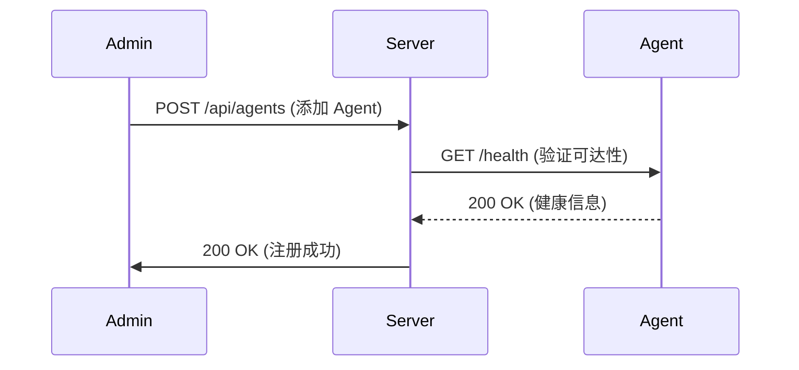
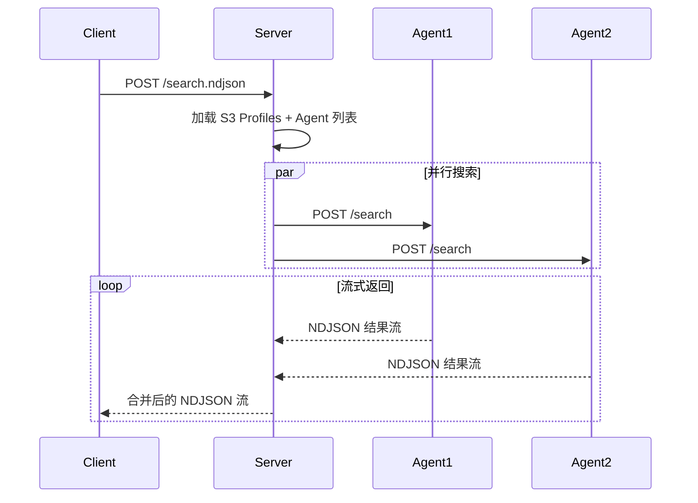

# Agent HTTP API 规范

## 📝 概述

**版本**: v1.0  
**更新时间**: 2025-10-08  
**状态**: 设计阶段

Agent Server 是 LogSeek 分布式架构的重要组成部分，运行在远程主机上，提供本地日志文件的搜索和访问能力。通过 HTTP API 与 LogSeek Server 通信，支持多 Agent 并行搜索。

---

## 🎯 设计目标

### 功能目标
1. ✅ **远程搜索** - 在 Agent 端执行搜索，减少网络传输
2. ✅ **文件访问** - 提供文件内容读取和元数据查询
3. ✅ **健康检查** - 监控 Agent 状态和性能指标
4. ✅ **流式传输** - 支持大文件和大量结果的流式传输
5. ✅ **任务管理** - 支持搜索进度查询和任务取消

### 非功能目标
1. ⭐ **高性能** - 支持并发搜索，充分利用本地 I/O
2. ⭐ **低延迟** - 流式返回结果，首屏快速响应
3. ⭐ **可观测** - 提供详细的指标和日志
4. ⭐ **安全** - 支持 Token 认证和路径白名单
5. ⭐ **容错** - 优雅处理错误，不影响其他 Agent

---

## 🔌 核心端点

### 1. 健康检查

**用途**: 检查 Agent 是否在线，获取基本信息和能力

#### GET /health

**请求**:
```http
GET /health HTTP/1.1
Host: agent.example.com:8090
```

**响应** (200 OK):
```json
{
  "status": "healthy",
  "agent_id": "server-01",
  "version": "1.0.0",
  "uptime_secs": 86400,
  "capabilities": {
    "supports_progress": true,
    "supports_cancellation": true,
    "supports_streaming": true,
    "max_concurrent_searches": 10
  },
  "stats": {
    "active_searches": 2,
    "total_searches": 1543,
    "total_files_scanned": 123456,
    "avg_search_time_ms": 250
  }
}
```

**字段说明**:
- `status`: Agent 健康状态 (`healthy` | `degraded` | `unhealthy`)
- `agent_id`: Agent 唯一标识符（主机名或配置的 ID）
- `version`: Agent 版本号
- `uptime_secs`: 运行时长（秒）
- `capabilities`: Agent 能力声明
- `stats`: 运行统计信息

---

### 2. 搜索文件（流式 NDJSON）

**用途**: 在 Agent 端执行搜索，流式返回匹配的文件路径和结果

#### POST /search

**请求**:
```http
POST /search HTTP/1.1
Host: agent.example.com:8090
Content-Type: application/json
Authorization: Bearer <token>

{
  "query": "ERROR",
  "scope": {
    "Directory": {
      "path": "/var/log/app",
      "recursive": true
    }
  },
  "options": {
    "path_filter": ".*\\.log$",
    "max_results": 10000,
    "timeout_secs": 300,
    "context_lines": 3
  }
}
```

**请求字段**:
- `query`: 搜索查询字符串（LogSeek 查询语法或正则表达式）
- `scope`: 搜索范围（详见 [SearchScope](#searchscope)）
- `options`: 搜索选项（详见 [SearchOptions](#searchoptions)）

**响应** (200 OK, NDJSON Stream):
```http
HTTP/1.1 200 OK
Content-Type: application/x-ndjson
Transfer-Encoding: chunked
```

```ndjson
{"type":"progress","task_id":"task-abc123","processed_files":10,"matched_files":2,"status":"Running"}
{"type":"match","file":"/var/log/app/error.log","line":42,"content":"2025-01-01 12:34:56 ERROR Connection timeout","before":["line 40","line 41"],"after":["line 43","line 44"]}
{"type":"match","file":"/var/log/app/app.log","line":105,"content":"2025-01-01 13:05:23 ERROR Database query failed"}
{"type":"progress","task_id":"task-abc123","processed_files":50,"matched_files":8,"status":"Running"}
{"type":"complete","task_id":"task-abc123","total_files":100,"matched_files":15,"elapsed_secs":2.5}
```

**响应消息类型**:

1. **progress** - 搜索进度更新
   ```json
   {
     "type": "progress",
     "task_id": "task-abc123",
     "processed_files": 50,
     "matched_files": 8,
     "total_files": 100,
     "status": "Running"
   }
   ```

2. **match** - 匹配结果
   ```json
   {
     "type": "match",
     "file": "/var/log/app/error.log",
     "line": 42,
     "content": "ERROR Connection timeout",
     "before": ["line 40", "line 41"],
     "after": ["line 43", "line 44"],
     "timestamp": "2025-01-01T12:34:56Z"
   }
   ```

3. **complete** - 搜索完成
   ```json
   {
     "type": "complete",
     "task_id": "task-abc123",
     "total_files": 100,
     "matched_files": 15,
     "elapsed_secs": 2.5
   }
   ```

4. **error** - 搜索错误
   ```json
   {
     "type": "error",
     "task_id": "task-abc123",
     "error": "Permission denied: /var/log/restricted.log",
     "error_code": "PERMISSION_DENIED"
   }
   ```

**错误响应**:
- 400 Bad Request - 查询语法错误或参数无效
- 401 Unauthorized - 认证失败
- 403 Forbidden - 路径不在白名单中
- 500 Internal Server Error - Agent 内部错误
- 503 Service Unavailable - Agent 繁忙或过载

---

### 3. 获取搜索进度（可选）

**用途**: 查询后台搜索任务的进度

#### GET /search/{task_id}

**请求**:
```http
GET /search/task-abc123 HTTP/1.1
Host: agent.example.com:8090
Authorization: Bearer <token>
```

**响应** (200 OK):
```json
{
  "task_id": "task-abc123",
  "status": "Running",
  "progress": {
    "processed_files": 50,
    "matched_files": 8,
    "total_files": 100,
    "elapsed_secs": 1.2
  },
  "created_at": "2025-01-01T12:34:56Z",
  "updated_at": "2025-01-01T12:34:57Z"
}
```

**状态值**:
- `Pending` - 等待执行
- `Running` - 正在执行
- `Completed` - 已完成
- `Failed` - 失败
- `Cancelled` - 已取消

---

### 4. 取消搜索（可选）

**用途**: 取消正在执行的搜索任务

#### DELETE /search/{task_id}

**请求**:
```http
DELETE /search/task-abc123 HTTP/1.1
Host: agent.example.com:8090
Authorization: Bearer <token>
```

**响应** (200 OK):
```json
{
  "task_id": "task-abc123",
  "status": "Cancelled",
  "message": "Search task cancelled successfully"
}
```

**错误响应**:
- 404 Not Found - 任务不存在
- 409 Conflict - 任务已完成，无法取消

---

### 5. 列出文件

**用途**: 列出指定目录或范围内的文件

#### POST /files/list

**请求**:
```http
POST /files/list HTTP/1.1
Host: agent.example.com:8090
Content-Type: application/json
Authorization: Bearer <token>

{
  "scope": {
    "Directory": {
      "path": "/var/log",
      "recursive": false
    }
  },
  "options": {
    "path_filter": ".*\\.log$",
    "max_results": 1000
  }
}
```

**响应** (200 OK):
```json
{
  "files": [
    {
      "path": "/var/log/app.log",
      "metadata": {
        "size": 1048576,
        "modified": 1704110400,
        "content_type": "text/plain"
      }
    },
    {
      "path": "/var/log/error.log",
      "metadata": {
        "size": 524288,
        "modified": 1704110300
      }
    }
  ],
  "total": 2,
  "truncated": false
}
```

**字段说明**:
- `files`: 文件列表
- `total`: 文件总数
- `truncated`: 是否被截断（达到 max_results 限制）

---

### 6. 读取文件内容

**用途**: 读取文件的完整内容或指定行范围

#### GET /files/read

**请求参数**:
- `path`: 文件路径（必需）
- `start_line`: 起始行号（可选，从 1 开始）
- `end_line`: 结束行号（可选）
- `max_bytes`: 最大字节数（可选，默认 10MB）

**请求示例**:
```http
GET /files/read?path=/var/log/app.log&start_line=100&end_line=200 HTTP/1.1
Host: agent.example.com:8090
Authorization: Bearer <token>
```

**响应** (200 OK):
```http
HTTP/1.1 200 OK
Content-Type: text/plain; charset=utf-8
X-File-Size: 1048576
X-File-Modified: 1704110400
X-Lines-Returned: 101

2025-01-01 12:00:00 INFO Application started
2025-01-01 12:00:01 DEBUG Loading configuration
...
2025-01-01 12:05:00 ERROR Connection failed
```

**响应头**:
- `Content-Type`: 文件内容类型
- `X-File-Size`: 文件总大小（字节）
- `X-File-Modified`: 修改时间（Unix 时间戳）
- `X-Lines-Returned`: 返回的行数

**错误响应**:
- 403 Forbidden - 文件路径不在白名单中
- 404 Not Found - 文件不存在
- 413 Payload Too Large - 请求的内容超过限制
- 500 Internal Server Error - 读取文件失败

---

### 7. 获取文件元数据

**用途**: 获取文件的元数据（不读取内容）

#### GET /files/metadata

**请求参数**:
- `path`: 文件路径（必需）

**请求示例**:
```http
GET /files/metadata?path=/var/log/app.log HTTP/1.1
Host: agent.example.com:8090
Authorization: Bearer <token>
```

**响应** (200 OK):
```json
{
  "path": "/var/log/app.log",
  "size": 1048576,
  "modified": 1704110400,
  "content_type": "text/plain",
  "permissions": "rw-r--r--",
  "is_symlink": false,
  "line_count": 5000
}
```

---

### 8. 获取指标

**用途**: 导出 Prometheus 格式的指标

#### GET /metrics

**请求**:
```http
GET /metrics HTTP/1.1
Host: agent.example.com:8090
```

**响应** (200 OK):
```prometheus
# HELP agent_searches_total Total number of searches
# TYPE agent_searches_total counter
agent_searches_total 1543

# HELP agent_searches_active Current active searches
# TYPE agent_searches_active gauge
agent_searches_active 2

# HELP agent_files_scanned_total Total files scanned
# TYPE agent_files_scanned_total counter
agent_files_scanned_total 123456

# HELP agent_search_duration_seconds Search duration in seconds
# TYPE agent_search_duration_seconds histogram
agent_search_duration_seconds_bucket{le="0.1"} 100
agent_search_duration_seconds_bucket{le="0.5"} 500
agent_search_duration_seconds_bucket{le="1.0"} 1000
agent_search_duration_seconds_bucket{le="+Inf"} 1543
agent_search_duration_seconds_sum 386.5
agent_search_duration_seconds_count 1543
```

---

## 📐 数据类型定义

### SearchScope

搜索范围定义：

```rust
pub enum SearchScope {
  /// 搜索指定目录
  Directory { 
    path: String,      // 目录路径
    recursive: bool    // 是否递归
  },
  
  /// 搜索指定文件列表
  Files { 
    paths: Vec<String> // 文件路径列表
  },
  
  /// 搜索 tar.gz 文件（Agent 端解压并搜索）
  TarGz { 
    path: String       // tar.gz 文件路径
  },
  
  /// 搜索所有（根据 Agent 配置的根目录）
  All,
}
```

**JSON 示例**:
```json
// 目录搜索
{"Directory": {"path": "/var/log", "recursive": true}}

// 文件列表搜索
{"Files": {"paths": ["/var/log/app.log", "/var/log/error.log"]}}

// tar.gz 搜索
{"TarGz": {"path": "/backup/logs-2025-01-01.tar.gz"}}

// 搜索所有
"All"
```

---

### SearchOptions

搜索选项：

```rust
pub struct SearchOptions {
  /// 文件路径过滤（正则表达式）
  pub path_filter: Option<String>,
  
  /// 最大结果数（达到后停止搜索）
  pub max_results: Option<usize>,
  
  /// 超时时间（秒）
  pub timeout_secs: Option<u64>,
  
  /// 上下文行数（匹配行前后各显示多少行）
  pub context_lines: Option<usize>,
}
```

**默认值**:
```rust
SearchOptions {
  path_filter: None,
  max_results: None,           // 无限制
  timeout_secs: Some(300),     // 5 分钟
  context_lines: Some(0),      // 不显示上下文
}
```

---

### FileMetadata

文件元数据：

```rust
pub struct FileMetadata {
  /// 文件大小（字节）
  pub size: Option<u64>,
  
  /// 修改时间（Unix 时间戳）
  pub modified: Option<i64>,
  
  /// 内容类型（MIME type）
  pub content_type: Option<String>,
}
```

---

### SearchProgress

搜索进度：

```rust
pub struct SearchProgress {
  pub task_id: String,
  pub processed_files: usize,
  pub matched_files: usize,
  pub total_files: Option<usize>,
  pub status: SearchStatus,
}

pub enum SearchStatus {
  Pending,
  Running,
  Completed,
  Failed(String),
  Cancelled,
}
```

---

## 🔐 安全与认证

### Token 认证

Agent 使用 Bearer Token 认证：

```http
Authorization: Bearer <token>
```

**Token 管理**:
1. Agent 启动时生成或从配置文件读取
2. LogSeek Server 在添加 Agent 时获取并保存 token
3. 所有 API 请求（除 `/health` 和 `/metrics`）都需要 token

**Token 验证失败响应**:
```http
HTTP/1.1 401 Unauthorized
Content-Type: application/json

{
  "error": "Unauthorized",
  "message": "Invalid or missing authentication token"
}
```

---

### 路径白名单

Agent 配置文件示例：
```yaml
agent:
  id: "server-01"
  port: 8090
  token: "secret-token-12345"
  
  # 路径白名单
  allowed_paths:
    - "/var/log"
    - "/opt/app/logs"
    - "/home/user/logs"
  
  # 路径黑名单（高优先级）
  denied_paths:
    - "/var/log/secure"
    - "/etc"
```

**路径检查逻辑**:
1. 首先检查黑名单，如果匹配则拒绝（403 Forbidden）
2. 然后检查白名单，如果不匹配则拒绝（403 Forbidden）
3. 支持通配符：`/var/log/*` 匹配所有子目录

---

## ⚡ 性能与限流

### 并发控制

Agent 配置并发限制：

```yaml
limits:
  # 最大并发搜索数
  max_concurrent_searches: 10
  
  # 每个搜索的最大并发文件读取数
  max_concurrent_files: 50
  
  # 最大内存使用（MB）
  max_memory_mb: 2048
```

**过载响应**:
```http
HTTP/1.1 503 Service Unavailable
Content-Type: application/json
Retry-After: 30

{
  "error": "Service Unavailable",
  "message": "Agent is currently overloaded, please retry later",
  "active_searches": 10,
  "max_searches": 10
}
```

---

### 超时控制

1. **连接超时**: 10 秒
2. **搜索超时**: 默认 300 秒（可通过 `timeout_secs` 配置）
3. **文件读取超时**: 30 秒

---

### 流控机制

**背压 (Backpressure)**:
- 使用 `mpsc::channel` 控制消息流速
- 如果客户端消费慢，Agent 会自动减速

**渐进式返回**:
- 每找到 N 个匹配（如 10 个）或每 T 秒（如 1 秒）返回一批
- 避免一次性返回大量结果导致内存溢出

---

## 🧪 集成测试场景

### 1. 基本搜索
```bash
# 搜索包含 ERROR 的日志
curl -X POST http://localhost:8090/search \
  -H "Content-Type: application/json" \
  -H "Authorization: Bearer secret-token" \
  -d '{
    "query": "ERROR",
    "scope": {"Directory": {"path": "/var/log", "recursive": true}},
    "options": {"context_lines": 3}
  }'
```

### 2. 健康检查
```bash
# 检查 Agent 健康状态
curl http://localhost:8090/health
```

### 3. 列出文件
```bash
# 列出目录下的日志文件
curl -X POST http://localhost:8090/files/list \
  -H "Content-Type: application/json" \
  -H "Authorization: Bearer secret-token" \
  -d '{
    "scope": {"Directory": {"path": "/var/log", "recursive": false}},
    "options": {"path_filter": ".*\\.log$"}
  }'
```

### 4. 读取文件
```bash
# 读取文件的 100-200 行
curl "http://localhost:8090/files/read?path=/var/log/app.log&start_line=100&end_line=200" \
  -H "Authorization: Bearer secret-token"
```

---

## 🎨 前端集成示例

### JavaScript/TypeScript

```typescript
// Agent 客户端封装
class AgentClient {
  constructor(
    private baseUrl: string,
    private token: string
  ) {}

  async health(): Promise<HealthResponse> {
    const res = await fetch(`${this.baseUrl}/health`);
    return res.json();
  }

  async *search(
    query: string,
    scope: SearchScope,
    options?: SearchOptions
  ): AsyncGenerator<SearchMessage> {
    const res = await fetch(`${this.baseUrl}/search`, {
      method: 'POST',
      headers: {
        'Content-Type': 'application/json',
        'Authorization': `Bearer ${this.token}`,
      },
      body: JSON.stringify({ query, scope, options }),
    });

    const reader = res.body!.getReader();
    const decoder = new TextDecoder();
    let buffer = '';

    while (true) {
      const { done, value } = await reader.read();
      if (done) break;

      buffer += decoder.decode(value, { stream: true });
      const lines = buffer.split('\n');
      buffer = lines.pop() || '';

      for (const line of lines) {
        if (line.trim()) {
          yield JSON.parse(line);
        }
      }
    }
  }
}

// 使用示例
const agent = new AgentClient('http://localhost:8090', 'secret-token');

// 检查健康状态
const health = await agent.health();
console.log('Agent:', health.agent_id, 'Status:', health.status);

// 流式搜索
for await (const msg of agent.search(
  'ERROR',
  { Directory: { path: '/var/log', recursive: true } },
  { context_lines: 3 }
)) {
  switch (msg.type) {
    case 'progress':
      console.log(`Progress: ${msg.processed_files} files processed`);
      break;
    case 'match':
      console.log(`Match: ${msg.file}:${msg.line} - ${msg.content}`);
      break;
    case 'complete':
      console.log(`Complete: ${msg.matched_files} matches in ${msg.elapsed_secs}s`);
      break;
    case 'error':
      console.error(`Error: ${msg.error}`);
      break;
  }
}
```

---

## 🔄 与 LogSeek Server 集成

### Agent 注册流程



### 搜索流程



---

## 🚧 实现路线图

### Phase 1: 核心功能 (MVP)
- [x] `/health` - 健康检查
- [ ] `/search` - 基本搜索（流式 NDJSON）
- [ ] `/files/read` - 文件读取
- [ ] Token 认证
- [ ] 路径白名单

### Phase 2: 完善功能
- [ ] `/files/list` - 文件列表
- [ ] `/files/metadata` - 文件元数据
- [ ] 并发控制和限流
- [ ] 搜索进度查询 (`GET /search/{task_id}`)
- [ ] 搜索取消 (`DELETE /search/{task_id}`)

### Phase 3: 高级功能
- [ ] `/metrics` - Prometheus 指标
- [ ] tar.gz 支持
- [ ] 压缩传输（gzip, brotli）
- [ ] 增量搜索和缓存
- [ ] 配置热加载

### Phase 4: 企业功能
- [ ] TLS/HTTPS 支持
- [ ] 多租户和权限管理
- [ ] 审计日志
- [ ] 高可用和故障转移

---

## 📚 相关文档

- [ARCHITECTURE_REVIEW.md](./ARCHITECTURE_REVIEW.md) - 架构复盘
- [LOCAL_FILESYSTEM_ENHANCEMENT.md](./LOCAL_FILESYSTEM_ENHANCEMENT.md) - 本地文件系统增强
- [ROUTES_REFACTOR_SUMMARY.md](./ROUTES_REFACTOR_SUMMARY.md) - 路由模块化

---

## 💡 未来优化

### 1. WebSocket 支持
使用 WebSocket 代替 HTTP 长连接，实现双向通信：
- 服务端主动推送搜索任务
- 客户端实时报告进度
- 更低的延迟和开销

### 2. gRPC 支持
使用 gRPC 提供高性能 RPC 接口：
- Protocol Buffers 序列化
- HTTP/2 多路复用
- 更好的流控和背压

### 3. 智能调度
Server 端根据 Agent 负载智能分配任务：
- 优先分配给空闲 Agent
- 避免过载 Agent
- 动态调整并发度

### 4. 缓存策略
Agent 端缓存常见查询结果：
- 最近搜索结果缓存
- 文件索引缓存
- 减少重复扫描

---

## 🎯 总结

Agent HTTP API 设计遵循以下原则：

1. ✅ **简单清晰** - RESTful 风格，易于理解和使用
2. ✅ **流式优先** - NDJSON 流式传输，支持大规模数据
3. ✅ **渐进式** - 分阶段实现，MVP 先行
4. ✅ **兼容现有架构** - 复用 `storage::` 模块的抽象和类型
5. ✅ **安全可控** - Token 认证 + 路径白名单
6. ✅ **可观测** - 健康检查 + Prometheus 指标
7. ✅ **高性能** - 并发控制 + 流控机制

**下一步**:
1. 实现 Agent Server 基本框架（Axum）
2. 实现 `/health` 端点
3. 实现 `/search` 端点（MVP）
4. 与现有 Server 集成测试

---

**文档版本**: v1.0  
**作者**: LogSeek Team  
**最后更新**: 2025-10-08
