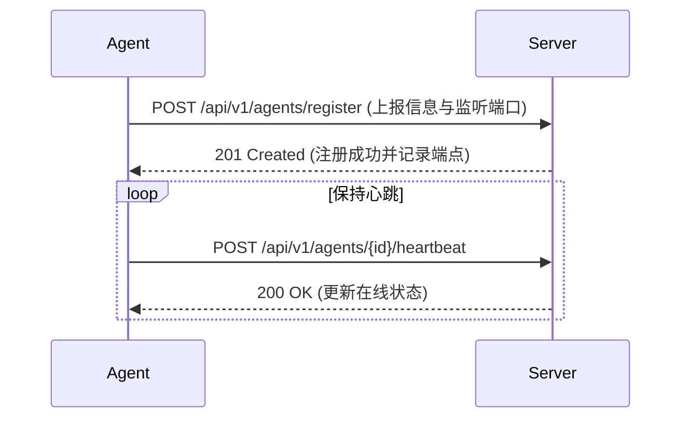
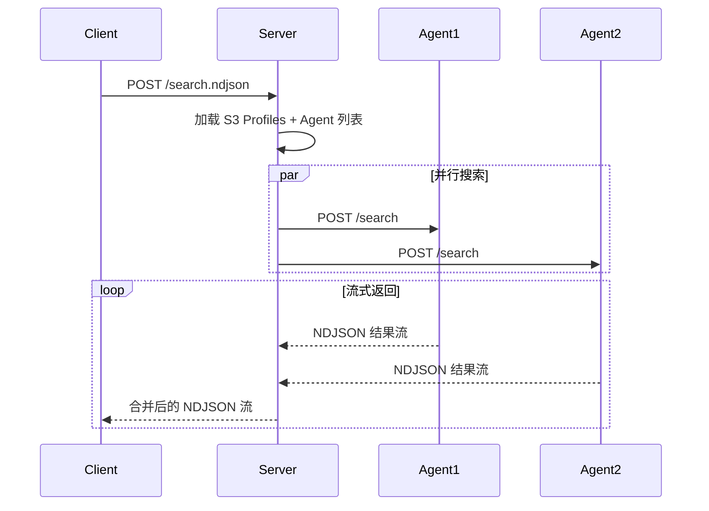

# Agent HTTP API 规范

**文档版本**: v1.0  
**最后更新**: 2025-11-10

## 📝 概述

Agent Server 是 LogSeek 分布式架构的重要组成部分，运行在远程主机上，提供本地日志文件的搜索和访问能力。通过 HTTP API 与 LogSeek Server 通信，支持多 Agent 并行搜索。

**当前状态**: 核心功能已实现（MVP），详见 [实现路线图](#-实现路线图)

---

## 🎯 设计目标

### 功能目标
1. ✅ **远程搜索** - 在 Agent 端执行搜索，减少网络传输
2. ✅ **文件访问** - 提供文件内容读取和元数据查询
3. ✅ **健康检查** - 监控 Agent 状态和性能指标
4. ✅ **流式传输** - 支持大文件和大量结果的流式传输
5. ✅ **任务管理** - 支持任务取消

### 非功能目标
1. ⭐ **高性能** - 支持并发搜索，充分利用本地 I/O
2. ⭐ **低延迟** - 流式返回结果，首屏快速响应
3. ⭐ **可观测** - 提供详细的指标和日志
4. ⭐ **安全** - 支持 Token 认证和路径白名单
5. ⭐ **容错** - 优雅处理错误，不影响其他 Agent

---

## 🔌 核心端点

### 1. 健康检查

**用途**: 检查 Agent 是否在线，获取基本信息和能力

#### GET /health

**请求**:
```http
GET /health HTTP/1.1
Host: agent.example.com:8090
```

**响应** (200 OK):
```
OK
```

**说明**: 健康检查端点返回简单的 "OK" 字符串，表示 Agent 正在运行。

---

### 2. 搜索文件（流式 NDJSON）

**用途**: 在 Agent 端执行搜索，流式返回匹配的文件路径和结果

#### POST /api/v1/search

**请求**:
```http
POST /api/v1/search HTTP/1.1
Host: agent.example.com:8090
Content-Type: application/json

{
  "task_id": "task-abc123",
  "query": "ERROR",
  "context_lines": 3,
  "path_filter": "**/*.log",
  "target": {
    "type": "dir",
    "path": "app",
    "recursive": true
  }
}
```

**请求字段**:
- `task_id`: 任务唯一标识符（必需）
- `query`: 搜索查询字符串（LogSeek 查询语法）
- `context_lines`: 上下文行数（必需）
- `path_filter`: 路径过滤（glob 模式，可选）
- `target`: 搜索目标（详见 [Target](#target)，必需）

**响应** (200 OK, NDJSON Stream):
```http
HTTP/1.1 200 OK
Content-Type: application/x-ndjson; charset=utf-8
Transfer-Encoding: chunked
```

```ndjson
{"type":"result","data":{"path":"/var/log/app/error.log","lines":["2025-01-01 12:34:56 ERROR Connection timeout"],"merged":[[0,0]],"encoding":null}}
{"type":"result","data":{"path":"/var/log/app/app.log","lines":["2025-01-01 13:05:23 ERROR Database query failed"],"merged":[[0,0]],"encoding":null}}
{"type":"complete","data":{"source":"agent-target","elapsed_ms":1250}}
```

**响应消息类型**:

1. **result** - 搜索结果
   ```json
   {
     "type": "result",
     "data": {
       "path": "/var/log/app/error.log",
       "lines": ["2025-01-01 12:34:56 ERROR Connection timeout"],
       "merged": [[0, 0]],
       "encoding": null
     }
   }
   ```
   - `path`: 文件路径
   - `lines`: 匹配的行内容（已包含上下文行）
   - `merged`: 匹配位置信息 `[(start, end), ...]`
   - `encoding`: 文件编码（如果不是 UTF-8）

2. **error** - 搜索错误
   ```json
   {
     "type": "error",
     "data": {
       "source": "agent-target",
       "message": "Target 解析失败: 未找到目录: nonexistent。可用的子目录: [\"app\", \"nginx\", \"system\"]",
       "recoverable": false
     }
   }
   ```
   - `source`: 错误来源标识
   - `message`: 错误信息
   - `recoverable`: 是否可恢复（true 表示错误非致命，可继续搜索其他源）

3. **complete** - 搜索完成
   ```json
   {
     "type": "complete",
     "data": {
       "source": "agent-target",
       "elapsed_ms": 1250
     }
   }
   ```
   - `source`: 来源标识
   - `elapsed_ms`: 搜索耗时（毫秒）

**错误响应**:
- 400 Bad Request - 查询语法错误或参数无效
- 401 Unauthorized - 认证失败
- 403 Forbidden - 路径不在白名单中
- 500 Internal Server Error - Agent 内部错误
- 503 Service Unavailable - Agent 繁忙或过载

---

### 3. 取消搜索（暂未实现）

**用途**: 取消正在执行的搜索任务

#### POST /api/v1/cancel/{task_id}

**请求**:
```http
POST /api/v1/cancel/task-abc123 HTTP/1.1
Host: agent.example.com:8090
```

**响应** (501 Not Implemented):
```
```

**说明**: 当前版本暂未实现任务取消功能，返回 501 状态码。

---

### 4. 获取 Agent 信息

**用途**: 获取 Agent 的详细信息和配置

#### GET /api/v1/info

**请求**:
```http
GET /api/v1/info HTTP/1.1
Host: agent.example.com:8090
```

**响应** (200 OK):
```json
{
  "id": "server-01",
  "name": "Production Server 01",
  "version": "0.1.0",
  "hostname": "server-01.example.com",
  "tags": [],
  "search_roots": ["/var/log", "/opt/app/logs"],
  "last_heartbeat": 1704110400,
  "status": "Online"
}
```

**字段说明**:
- `id`: Agent 唯一标识符
- `name`: Agent 名称
- `version`: Agent 版本号
- `hostname`: 主机名
- `tags`: 标签列表
- `search_roots`: 搜索根目录列表
- `last_heartbeat`: 最后心跳时间（Unix 时间戳）
- `status`: Agent 状态 (`Online` | `Offline`)

### 5. 列出可用路径

**用途**: 列出 Agent 可用的搜索子目录

#### GET /api/v1/paths

**请求**:
```http
GET /api/v1/paths HTTP/1.1
Host: agent.example.com:8090
```

**响应** (200 OK):
```json
["app", "nginx", "system", "web"]
```

**说明**: 返回在 `search_roots` 下找到的所有一级子目录列表，用于错误提示和路径选择。

---

## 📐 数据类型定义

### Target

搜索目标定义（与 Server 端配置统一）：

```rust
pub enum Target {
  /// 目录
  Dir {
    path: String,      // 目录路径（相对 subpath）
    recursive: bool    // 是否递归（默认 true）
  },
  
  /// 文件清单
  Files { 
    paths: Vec<String> // 文件路径列表（相对 subpath）
  },
  
  /// 归档（自动探测 tar/tar.gz/gz/zip；zip 暂不支持）
  Archive { 
    path: String       // 归档文件路径（相对 subpath）
  },
}
```

**JSON 示例**:
```json
// 目录搜索
{"type": "dir", "path": "app", "recursive": true}

// 文件列表搜索
{"type": "files", "paths": ["app/error.log", "nginx/access.log"]}

// 归档搜索
{"type": "archive", "path": "backup/logs-2025-01-01.tar.gz"}
```

**注意**：
- 所有路径均相对 `subpath`（Agent endpoint 的 subpath 字段）
- `path: "."` 表示根目录（相对于 subpath）
- 已移除 `All` 类型，使用 `Dir { path: ".", recursive: true }` 替代

---

### AgentSearchRequest

Agent 搜索请求：

```rust
pub struct AgentSearchRequest {
  pub task_id: String,
  pub query: String,
  pub context_lines: usize,
  pub path_filter: Option<String>,
  pub target: Target,
}
```

**字段说明**:
- `task_id`: 任务唯一标识符（由调用方生成）
- `query`: 搜索查询字符串（LogSeek 查询语法）
- `context_lines`: 上下文行数（匹配行前后各显示多少行）
- `path_filter`: 路径过滤（glob 模式，可选）
- `target`: 搜索目标（详见 [Target](#target)）

---

### SearchResult

搜索结果：

```rust
pub struct SearchResult {
  pub path: String,
  pub lines: Vec<String>,
  pub merged: Vec<(usize, usize)>,
  pub encoding: Option<String>,
}
```

**字段说明**:
- `path`: 文件路径
- `lines`: 匹配的行内容（已包含上下文行）
- `merged`: 匹配位置信息，格式为 `[(start, end), ...]`，表示每个匹配在 `lines` 中的位置
- `encoding`: 文件编码（如果不是 UTF-8，则包含编码名称，如 "GBK"）

---


## 🔐 安全与认证

### 认证

**当前版本**: Agent API 暂未实现认证机制，所有端点均可直接访问。

**未来计划**: 将支持 Token 认证和路径白名单验证。

---

### 路径白名单

Agent 通过 `--search-roots` 参数配置可搜索的根目录：

```bash
./opsbox-agent start \
  --search-roots "/var/log,/opt/app/logs" \
  --agent-id "server-01"
```

**路径检查逻辑**:
1. 所有搜索路径必须位于 `search_roots` 配置的根目录下
2. 支持相对路径，Agent 会在所有 `search_roots` 下查找
3. 绝对路径必须规范化后位于某个根目录下
4. 如果路径不在白名单中，返回错误信息并提示可用的子目录

---

## ⚡ 性能与限流

### 并发控制

Agent 配置并发限制：

```yaml
limits:
  # 最大并发搜索数
  max_concurrent_searches: 10
  
  # 每个搜索的最大并发文件读取数
  max_concurrent_files: 50
  
  # 最大内存使用（MB）
  max_memory_mb: 2048
```

**过载响应**:
```http
HTTP/1.1 503 Service Unavailable
Content-Type: application/json
Retry-After: 30

{
  "error": "Service Unavailable",
  "message": "Agent is currently overloaded, please retry later",
  "active_searches": 10,
  "max_searches": 10
}
```

---

### 超时控制

1. **连接超时**: 10 秒
2. **搜索超时**: 默认 300 秒（可通过 `timeout_secs` 配置）
3. **文件读取超时**: 30 秒

---

### 流控机制

**背压 (Backpressure)**:
- 使用 `mpsc::channel` 控制消息流速
- 如果客户端消费慢，Agent 会自动减速

**渐进式返回**:
- 每找到 N 个匹配（如 10 个）或每 T 秒（如 1 秒）返回一批
- 避免一次性返回大量结果导致内存溢出

---

## 🧪 集成测试场景

### 1. 基本搜索
```bash
# 搜索包含 ERROR 的日志
curl -X POST http://localhost:8090/api/v1/search \
  -H "Content-Type: application/json" \
  -d '{
    "task_id": "task-001",
    "query": "ERROR",
    "context_lines": 3,
    "target": {
      "type": "dir",
      "path": "app",
      "recursive": true
    }
  }'
```

### 2. 健康检查
```bash
# 检查 Agent 健康状态
curl http://localhost:8090/health
# 返回: OK
```

### 3. 获取 Agent 信息
```bash
# 获取 Agent 详细信息
curl http://localhost:8090/api/v1/info
```

### 4. 列出可用路径
```bash
# 列出可用的搜索子目录
curl http://localhost:8090/api/v1/paths
# 返回: ["app", "nginx", "system"]
```

---

## 🎨 前端集成示例

### JavaScript/TypeScript

```typescript
// Agent 客户端封装
class AgentClient {
  constructor(
    private baseUrl: string
  ) {}

  async health(): Promise<string> {
    const res = await fetch(`${this.baseUrl}/health`);
    return res.text();
  }

  async *search(
    taskId: string,
    query: string,
    contextLines: number,
    target: Target,
    pathFilter?: string
  ): AsyncGenerator<SearchEvent> {
    const res = await fetch(`${this.baseUrl}/api/v1/search`, {
      method: 'POST',
      headers: {
        'Content-Type': 'application/json',
      },
      body: JSON.stringify({
        task_id: taskId,
        query,
        context_lines: contextLines,
        path_filter: pathFilter,
        target,
      }),
    });

    const reader = res.body!.getReader();
    const decoder = new TextDecoder();
    let buffer = '';

    while (true) {
      const { done, value } = await reader.read();
      if (done) break;

      buffer += decoder.decode(value, { stream: true });
      const lines = buffer.split('\n');
      buffer = lines.pop() || '';

      for (const line of lines) {
        if (line.trim()) {
          yield JSON.parse(line);
        }
      }
    }
  }
}

// 使用示例
const agent = new AgentClient('http://localhost:8090');

// 检查健康状态
const health = await agent.health();
console.log('Agent health:', health); // 输出: OK

// 流式搜索
for await (const event of agent.search(
  'task-001',
  'ERROR',
  3,
  { type: 'dir', path: 'app', recursive: true },
  '**/*.log'
)) {
  switch (event.type) {
    case 'result':
      console.log(`Match: ${event.data.path} - ${event.data.lines.join('\n')}`);
      break;
    case 'complete':
      console.log(`Complete: ${event.data.source} (${event.data.elapsed_ms}ms)`);
      break;
    case 'error':
      console.error(`Error: ${event.data.message}`);
      break;
  }
}
```

---

## 🔄 与 LogSeek Server 集成

### Agent 注册流程



### 搜索流程



---

## 🚧 实现路线图

### Phase 1: 核心功能 (MVP) ✅
- [x] `/health` - 健康检查
- [x] `/api/v1/search` - 基本搜索（流式 NDJSON）
- [x] `/api/v1/info` - Agent 信息
- [x] `/api/v1/paths` - 可用路径列表
- [x] 路径白名单（通过 search_roots）
- [x] Target 支持（Dir, Files, Archive）

### Phase 2: 完善功能
- [ ] `/api/v1/cancel/{task_id}` - 搜索取消（当前返回 501）
- [ ] 并发控制和限流
- [ ] Token 认证
- [ ] 文件读取和元数据查询

### Phase 3: 高级功能
- [ ] `/metrics` - Prometheus 指标
- [ ] 压缩传输（gzip, brotli）
- [ ] 增量搜索和缓存
- [ ] 配置热加载

### Phase 4: 企业功能
- [ ] TLS/HTTPS 支持
- [ ] 多租户和权限管理
- [ ] 审计日志
- [ ] 高可用和故障转移

---

## 📚 相关文档

- [架构复盘分析](../architecture/architecture.md) - 项目架构详细分析
- [模块化架构](../architecture/module-architecture.md) - 模块化架构设计
- [错误处理架构](../architecture/error-handling-architecture.md) - 错误处理设计


## 🎯 总结

Agent HTTP API 设计遵循以下原则：

1. ✅ **简单清晰** - RESTful 风格，易于理解和使用
2. ✅ **流式优先** - NDJSON 流式传输，支持大规模数据
3. ✅ **渐进式** - 分阶段实现，MVP 先行
4. ✅ **兼容现有架构** - 复用 `storage::` 模块的抽象和类型
5. ✅ **安全可控** - Token 认证 + 路径白名单
6. ✅ **可观测** - 健康检查 + Prometheus 指标
7. ✅ **高性能** - 并发控制 + 流控机制

**当前进展**:
- ✅ Phase 1 (MVP) 已完成：核心搜索功能已实现并投入使用
- 🔄 Phase 2 进行中：完善功能和优化

